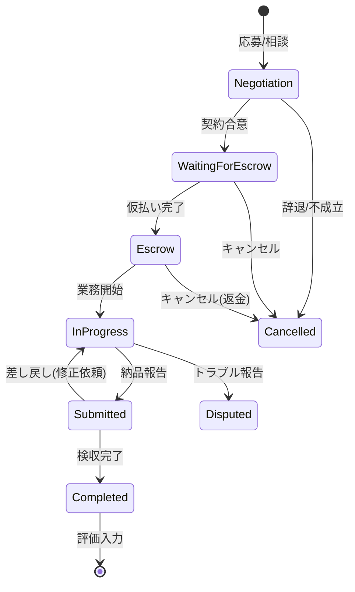
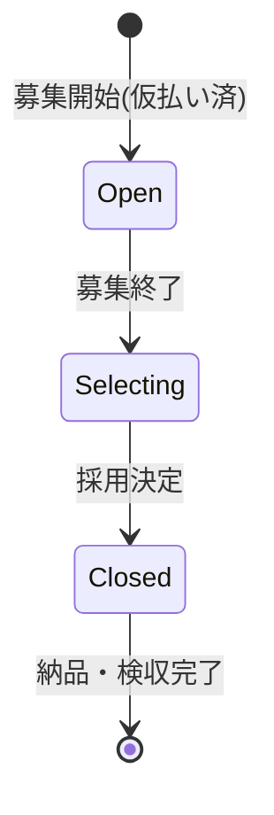
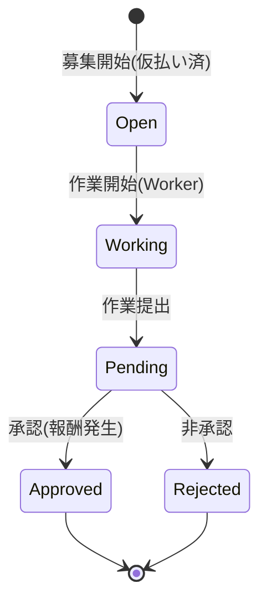

# クラウドソーシングプラットフォーム「Project Market Hub」詳細開発仕様書 (Ver 5.0)

## 1. プロジェクト定義 & コアコンセプト

### 1.1 概要
本プロジェクトは、クライアント（発注者）とワーカー（受注者）をマッチングするクラウドソーシングプラットフォーム**「Project Market Hub」**である。
最大の特徴は、**「単一アカウント・デュアルモード」**システムである。ユーザーはログアウトすることなく、ヘッダーのスイッチ一つで「クライアントモード」と「ワーカーモード」を瞬時に切り替えられる。

### 1.2 デザインシステム & UI規定
**コンセプト:** 「信頼 (Trust)」「清涼 (Clean)」「知性 (Intelligence)」
**デザイン原則:**
*   **余白の重視:** 情報過多になりがちな管理画面において、十分なパディングを取り、視認性を高める。
*   **明確なアクション:** 「次に何をすべきか」を色と配置で直感的に伝える。
*   **フィードバック:** ユーザーの操作（保存、送信、エラー）に対し、必ずトースト通知やローディング表示を行う。

**カラーパレット (Tailwind CSS):**
*   `primary`: `#00A3AF` (メインカラー: 爽やかな青緑) - アクションボタン、リンク、アクティブ状態
*   `primary-hover`: `#008C96`
*   `secondary`: `#0F2350` (アクセント: 濃紺) - ヘッダー、フッター、見出し、重要テキスト
*   `accent`: `#FF9F1C` (CTAボタン: オレンジ) - 契約、支払い、応募などのコンバージョンアクション
*   `danger`: `#EF4444` (削除・キャンセル・警告)
*   `background`: `#F9FAFB` (ベース背景色)
*   `surface`: `#FFFFFF` (カード・コンテンツ背景)
*   `text-body`: `#374151` (本文)
*   `text-muted`: `#6B7280` (補足情報)

**フォント:**
*   日本語: "Noto Sans JP", sans-serif
*   英語: "Inter", sans-serif

**コンポーネント:**
*   **Button:** `px-4 py-2 rounded-lg transition-all duration-200 font-medium shadow-sm active:scale-95`
*   **Card:** `bg-white rounded-xl shadow-sm border border-gray-100 p-6`
*   **Input:** `w-full rounded-lg border-gray-300 focus:border-primary focus:ring-primary`

---

## 2. 業務フロー詳細設計 (Workflow Definitions)

CrowdWorksの仕様に準拠し、以下の3方式を実装する。**時間単価制は採用しない。**
全てのフローにおいて、**「エスクロー（仮払い）」**が必須であり、ワーカーの報酬未払いリスクを排除する。

### 2.1 プロジェクト方式（固定報酬制 - Fixed Price）
最も汎用的な形式。要件定義から納品まで、1対1（または1対多）で進行する。

#### 状態遷移図 (State Machine)


#### 詳細ステップ & ロジック

**Phase 1: マッチング (Matching)**
1.  **募集 (Client)**
    *   **Action:** `/client/jobs/new` で仕事作成。
    *   **Input:** タイトル、詳細(MD)、カテゴリ、予算、期限、添付ファイル。
    *   **DB:** `jobs` 作成 (`status: 'open'`, `budgetType: 'fixed'`).
2.  **検索 & 応募 (Worker)**
    *   **Action:** `/worker/search` で検索し、詳細画面へ。
    *   **Action:** 「応募する」ボタン押下。
    *   **Input:** 提示金額(税抜)、完了予定日、メッセージ。
    *   **DB:** `proposals` 作成 (`status: 'pending'`).
    *   **Notification:** クライアントへ「新着応募」通知。
3.  **条件交渉 (Both)**
    *   **UI:** `/messages/[roomId]` でチャット。
    *   **Action:**
        *   **Client:** 応募内容を見て「新しい条件を提示」または「この条件で契約」。
        *   **Worker:** クライアントの提示に対し「同意」または「条件を変更して再提示」。
    *   **Logic:** `proposals` ドキュメント内の `negotiationHistory` 配列に履歴を追記し、最新の `price` を更新する。

**Phase 2: 契約 & 仮払い (Contract & Escrow)**
4.  **契約締結 (Client)**
    *   **Action:** クライアントが最終条件で「契約する」ボタン押下。
    *   **DB:** `contracts` 作成 (`status: 'waiting_for_escrow'`). `jobs.status` は `filled` (募集終了) または `open` (複数名採用時) に設定。
    *   **Notification:** ワーカーへ「契約が締結されました。仮払いを待ってください」と通知。
5.  **仮払い (Client)**
    *   **UI:** 契約画面 (`/client/contracts/[id]`) に「仮払いへ進む」ボタン出現。
    *   **Action:** Stripe Elements (Card) で決済。
    *   **System (Backend):** `/api/stripe/create-payment-intent`
        *   `stripe.paymentIntents.create` を実行。
        *   `amount`: 契約金額 + 消費税。
        *   `currency`: `jpy`.
        *   `capture_method`: `'manual'` (**重要: ここでは決済確定させない**).
        *   `transfer_data`: `{ destination: worker_stripe_account_id }`.
        *   `application_fee_amount`: 契約金額の 5% (プラットフォーム手数料).
    *   **DB:** 成功時、`contracts.status` → `'escrow'`. `stripePaymentIntentId` を保存。
    *   **Notification:** ワーカーへ「仮払いが完了しました。業務を開始してください」と通知。

**Phase 3: 業務 & 納品 (Work & Delivery)**
6.  **業務開始 (Worker)**
    *   **Constraint:** `status === 'escrow'` になるまで、納品ボタンは無効化(Disabled)する。
7.  **納品 (Worker)**
    *   **Action:** 成果物ファイルをアップロード、またはURLを記載し、メッセージを添えて「納品報告」ボタン押下。
    *   **DB:** `contracts.status` → `'submitted'`. `contracts.deliveryFileUrl` 更新。
    *   **Notification:** クライアントへ「納品報告がありました。検収してください」と通知。

**Phase 4: 検収 & 支払い (Acceptance & Payment)**
8.  **検収 (Client)**
    *   **UI:** 契約画面に「検収完了」と「修正依頼」ボタン出現。
    *   **Case A: 修正依頼 (Reject)**
        *   **Input:** 修正指示メッセージ (必須)。
        *   **DB:** `contracts.status` → `'in_progress'`.
        *   **Notification:** ワーカーへ「修正依頼が届きました」と通知。
    *   **Case B: 検収完了 (Accept)**
        *   **Action:** 「検収完了」ボタン押下。
        *   **System (Backend):** `/api/stripe/capture-payment-intent`
            *   `stripe.paymentIntents.capture(intentId)` を実行。これをもって決済確定・送金となる。
        *   **DB:** `contracts.status` → `'completed'`. `contracts.completedAt` 更新。
        *   **Notification:** ワーカーへ「検収完了・報酬確定」通知。
9.  **評価 (Both)**
    *   **UI:** 相互評価モーダル (Star Rating 1-5 + Comment)。
    *   **DB:** `users` の `rating` (平均点) と `reviewCount` を再計算して更新。

---

### 2.2 コンペ方式（Competition Format）
「ロゴ作成」や「ネーミング」など、多数の案から選びたい場合。

#### 状態遷移図


#### 詳細ステップ & ロジック

1.  **募集 & 先払い (Client)**
    *   **Action:** 仕事作成時に「コンペ方式」を選択。
    *   **Logic:** **公開前に仮払い(PaymentIntent作成)が必須。** これによりワーカーは安心して提案できる。
    *   **DB:** 決済成功後、`jobs` 作成 (`status: 'open'`, `type: 'competition'`).
2.  **提案 (Worker)**
    *   **Action:** 作品画像などを添付して「提案する」。
    *   **DB:** `proposals` 作成 (`status: 'pending'`). `attachments` にURL配列保存。
    *   **UI:** 提案一覧はグリッド表示。
3.  **選定 (Client)**
    *   **Trigger:** 募集期限到来、またはクライアントが早期終了を選択。
    *   **DB:** `jobs.status` → `'selecting'`.
    *   **Action:** 提案一覧から採用作品を選択し「採用する」。
    *   **DB:**
        *   採用された `proposal.status` → `'adopted'`.
        *   不採用の `proposal.status` → `'rejected'`.
        *   `contracts` 自動作成 (`status: 'submitted'` - 納品待ち).
4.  **納品 (Worker)**
    *   **Context:** 提案時のデータは透かし入り等の確認用である場合が多いため、正式データを納品するフローを挟む。
    *   **Action:** 採用ワーカーが正式データをアップロード。
    *   **DB:** `contracts` に納品URL保存。
5.  **検収 & 支払い (Client)**
    *   **Action:** データ確認後「検収完了」。
    *   **System:** PaymentIntentを `capture`。
    *   **DB:** `contracts.status` → `'completed'`. `jobs.status` → `'closed'`.

---

### 2.3 タスク方式（Task Format）
「アンケート」や「データ入力」など、単純作業の大量発注。

#### 状態遷移図


#### 詳細ステップ & ロジック

1.  **募集 & 先払い (Client)**
    *   **Input:** 単価(円)、件数(人)、制限時間(分)、設問(JSON)。
    *   **Calc:** `Total Budget = Unit Price * Quantity`.
    *   **System:** 総額分を仮払い (`capture_method: 'manual'`).
    *   **DB:** `jobs` 作成 (`status: 'open'`, `type: 'task'`, `task: { ... }`).
2.  **作業実施 (Worker)**
    *   **Action:** 「作業を開始する」ボタン押下。
    *   **Logic:** **排他制御:** 同一ユーザーは同時に1つのタスクしか作業できない。
    *   **DB:** `task_submissions` 作成 (`status: 'working'`, `startedAt: serverTimestamp()`).
    *   **UI:** 画面上に残り時間のカウントダウンタイマーを表示。
    *   **Action:** 設問に回答し「作業を完了する」。
    *   **Validation:** `serverTimestamp` と `startedAt` の差分が `timeLimit` 以内かチェック。
    *   **DB:** `task_submissions.status` → `'pending'`.
3.  **承認 (Client)**
    *   **UI:** `/client/jobs/[id]/tasks` で提出一覧を確認。
    *   **Action:** 各提出に対し「承認」または「非承認」を選択。
    *   **Logic:** 非承認時は理由入力必須。
    *   **DB:** `task_submissions.status` 更新。
4.  **完了 & 決済 (System)**
    *   **Trigger:** 全件承認完了、または募集期限終了。
    *   **Calc:** `Final Amount = Unit Price * Approved Count`.
    *   **System:**
        *   `stripe.paymentIntents.capture(intentId, { amount_to_capture: Final Amount })`.
        *   差額（非承認分や未消化分）は自動的にリリース（返金）される。

---

## 3. アカウント・マイページ詳細仕様 (Account & Personal Page Specs)

CrowdWorksのマイページ構成をベースに、本プラットフォーム独自の「デュアルモード」を統合した設計とする。
ユーザーは「共通設定」「ワーカー設定」「クライアント設定」の3つのカテゴリで情報を管理する。

### 3.1 画面構成 (UI Structure)
*   **レイアウト:** 左サイドバーに設定メニュー、右側に編集フォームを配置する2カラムレイアウト。
*   **レスポンシブ:** モバイル時はハンバーガーメニューまたはドロップダウンでメニューを表示。

### 3.2 メニュー項目一覧 (Navigation Menu)

#### A. 共通設定 (Common Settings)
1.  **基本情報編集 (Basic Info)**
    *   氏名、住所、電話番号などの個人情報。契約書面や本人確認の基礎となる重要情報。
2.  **メールアドレス・パスワード (Email & Security)**
    *   ログイン情報の変更。
3.  **本人確認書類提出 (Identity Verification)**
    *   身分証のアップロードとステータス確認。信頼性向上のため必須推奨。
4.  **通知設定 (Notifications)**
    *   メール通知、プッシュ通知のON/OFF。
5.  **退会申請 (Delete Account)**
    *   アカウント削除フロー。

#### B. ワーカー設定 (Worker Settings)
1.  **ワーカープロフィール (Public Profile)**
    *   表示名、職種、スキル、自己紹介。クライアントに公開される情報。
2.  **スキル・ポートフォリオ (Skills & Portfolio)**
    *   実績や作品の登録。
3.  **報酬振込先 (Payout Settings)**
    *   Stripe Connectアカウント管理画面へのリンク。

#### C. クライアント設定 (Client Settings)
1.  **クライアントプロフィール (Company Profile)**
    *   会社名、事業内容、URL。ワーカーに公開される情報。
2.  **支払い方法 (Payment Methods)**
    *   クレジットカード管理 (Stripe Customer Portal)。

---

### 3.3 詳細フィールド定義 (Field Definitions)

#### (1) 基本情報編集 (`/account/profile`)
**目的:** 契約や本人確認に使用する正式な情報を登録する。非公開。

| 項目名 | 必須 | 型 | 制約/備考 |
| :--- | :---: | :--- | :--- |
| **氏名 (漢字)** | 必須 | String | 全角。本人確認書類と一致すること。 |
| **氏名 (カナ)** | 必須 | String | 全角カタカナ。口座名義と一致すること。 |
| **生年月日** | 必須 | Date | **登録後変更不可**。未成年チェックに使用。 |
| **性別** | 任意 | Enum | 男性/女性/その他/無回答 |
| **郵便番号** | 必須 | String | 7桁 (ハイフンなし可)。入力時に住所自動補完。 |
| **都道府県** | 必須 | Select | 47都道府県。 |
| **市区町村・番地** | 必須 | String | |
| **建物名・部屋番号** | 任意 | String | |
| **電話番号** | 必須 | String | ハイフンなし。将来的にSMS認証に使用。 |

#### (2) ワーカープロフィール (`/account/worker/profile`)
**目的:** クライアントにアピールするための公開情報。

| 項目名 | 必須 | 型 | 制約/備考 |
| :--- | :---: | :--- | :--- |
| **表示名** | 必須 | String | ニックネーム可。デフォルトは氏名。 |
| **キャッチコピー** | 必須 | String | 最大50文字。検索結果に表示される。 |
| **職種** | 必須 | Select | エンジニア/デザイナー/ライター等 (大カテゴリ > 小カテゴリ)。 |
| **自己紹介** | 必須 | Text | Markdown対応。最大3000文字。 |
| **稼働可能時間** | 必須 | Select | 週10時間未満 / 10-20時間 / 20-30時間 / 30時間以上 |
| **希望単価** | 任意 | Number | 時給換算の目安 (円)。 |

#### (3) 本人確認 (`/account/verification`)
**目的:** 信頼性担保。Stripe Identityを利用して本人確認を行う。
**仕様:** **Stripe Identity**を利用した自動本人確認フローを採用する。

*   **ステータス:**
    *   `unsubmitted`: 未提出
    *   `pending`: 審査中 (Stripeにて処理中)
    *   `approved`: 承認済み (バッジ付与)
    *   `rejected`: 否認 (再提出が必要)
*   **UI:**
    *   「本人確認を行う」ボタン (Stripe Identityの検証フローへリダイレクト)
    *   結果表示 (承認/否認/審査中)
    *   ※否認時はStripeからの理由を表示する。

#### (4) 報酬振込先 (`/account/worker/payout`)
**仕様:** Stripe Connect (Express) を使用するため、直接口座情報は保持しない。
*   **UI:** 「Stripeアカウントを確認・編集する」ボタンを配置。
*   **挙動:** クリックすると Stripe Hosted Dashboard へリダイレクトする。
*   **ステータス表示:** 「連携済み」「未連携」「情報不足」等のStripeアカウント状態を表示する。

#### (5) 通知設定 (`/account/notifications`)
**仕様:** 各種イベントごとのメール送信可否設定。

| 項目名 | デフォルト | 説明 |
| :--- | :---: | :--- |
| **重要なお知らせ** | ON (固定) | 運営からの重要連絡。OFF不可。 |
| **メッセージ受信** | ON | クライアント/ワーカーからのメッセージ。 |
| **契約・業務連絡** | ON | 契約締結、仮払い、検収等の通知。 |
| **スカウトメール** | ON | クライアントからのスカウト。 |
| **デイリーサマリー** | OFF | おすすめ案件などのまとめメール。 |

---

## 4. データベース設計 (Firestore Schema)

NoSQLの特性を活かし、読み取り最適化（非正規化）を行う。

### `users` (Collection)
ユーザーの基本情報。
```typescript
interface User {
  uid: string;                 // Auth UID
  email: string;
  displayName: string;         // ワーカー表示名 (ニックネーム)
  photoURL: string;
  userType: 'client' | 'worker' | 'both';
  createdAt: Timestamp;
  updatedAt: Timestamp;
  
  // Personal Info (Private - for Verification & Contracts)
  name?: string;               // 本名 (漢字)
  nameKana?: string;           // 本名 (カナ)
  birthDate?: string;          // YYYY-MM-DD
  gender?: string;
  address?: {
    postalCode: string;
    prefecture: string;
    city: string;
    building?: string;
  };
  phoneNumber?: string;
  
  // Verification
  verificationStatus: 'unsubmitted' | 'pending' | 'approved' | 'rejected';
  verificationRejectionReason?: string;
  identityDocumentUrls?: string[]; // [front, back] (Admin only)

  // Stripe Connect
  stripeAccountId?: string;    // Worker: Express Account ID (acct_...)
  stripeCustomerId?: string;   // Client: Customer ID (cus_...)
  stripeOnboardingComplete: boolean;

  // Profiles
  clientProfile?: {
    companyName?: string;
    description?: string;
    website?: string;
  };
  workerProfile?: {
    title: string;             // キャッチコピー e.g. "Frontend Developer"
    bio: string;               // 自己紹介
    skills: string[];          // e.g. ["React", "TypeScript"]
    portfolioUrls?: string[];
    hoursPerWeek?: string;     // 稼働可能時間
    desiredUnitPrice?: number; // 希望単価
  };

  // Notification Settings
  notificationSettings?: {
    emailMessage: boolean;
    emailContract: boolean;
    emailScout: boolean;
    emailDaily: boolean;
  };

  // Stats (Denormalized)
  rating: number;              // 0.0 - 5.0
  reviewCount: number;
  jobsCompleted: number;
}
```

### `jobs` (Collection)
案件情報。
```typescript
interface Job {
  id: string;
  clientId: string;
  clientName: string;          // 非正規化
  clientPhotoURL: string;      // 非正規化
  
  title: string;
  description: string;         // Markdown
  category: string;            // e.g. "development", "design"
  tags: string[];
  
  type: 'project' | 'competition' | 'task';
  budgetType: 'fixed';         // 固定報酬のみ
  budget: number;              // 予算目安
  deadline: Timestamp;         // 募集期限
  
  status: 'open' | 'selecting' | 'closed' | 'filled' | 'cancelled';
  
  // Type specific data
  competition?: {
    guaranteed: boolean;       // 採用確約
    additionalPrizes?: number[];
  };
  task?: {
    unitPrice: number;
    quantity: number;
    timeLimit: number;         // 分単位
    questions: {
      id: string;
      type: 'text' | 'radio' | 'checkbox';
      text: string;
      options?: string[];
      required: boolean;
    }[];
  };

  createdAt: Timestamp;
  updatedAt: Timestamp;
  proposalCount: number;       // 非正規化カウンター
}
```

### `proposals` (Collection)
応募・提案情報。
```typescript
interface Proposal {
  id: string;
  jobId: string;
  clientId: string;            // クエリ用
  workerId: string;
  
  // Worker Info (Denormalized)
  workerName: string;
  workerPhotoURL: string;
  
  // Proposal Content
  price: number;               // 提案金額 (税抜)
  message: string;
  estimatedDuration: string;   // e.g. "1 week"
  attachments: string[];       // ファイルURL
  
  status: 'pending' | 'interviewing' | 'rejected' | 'hired' | 'adopted';
  
  // Negotiation History
  negotiationHistory: {
    senderId: string;
    price: number;
    message: string;
    createdAt: Timestamp;
  }[];

  createdAt: Timestamp;
  updatedAt: Timestamp;
}
```

### `contracts` (Collection)
契約・取引情報。**最重要コレクション。**
```typescript
interface Contract {
  id: string;
  jobId: string;
  clientId: string;
  workerId: string;
  
  // Snapshot
  jobTitle: string;
  jobType: 'project' | 'competition' | 'task';
  
  // Financials
  amount: number;              // 契約金額 (税抜)
  tax: number;                 // 消費税 (amount * 0.1)
  totalAmount: number;         // 税込請求額 (amount + tax)
  platformFee: number;         // 手数料 (amount * 0.05)
  workerReceiveAmount: number; // ワーカー受取額 (amount - platformFee)
  
  // Status
  status: 
    | 'waiting_for_escrow' // 仮払い待ち
    | 'escrow'             // 仮払い済み・作業待ち
    | 'in_progress'        // 作業中（修正対応含む）
    | 'submitted'          // 納品確認中
    | 'disputed'           // トラブル中
    | 'completed'          // 検収完了・支払済
    | 'cancelled';         // キャンセル

  // Stripe
  stripePaymentIntentId: string;
  stripeTransferId?: string;
  
  // Delivery
  deliveryFileUrl?: string;
  deliveryMessage?: string;
  
  createdAt: Timestamp;
  escrowAt?: Timestamp;
  submittedAt?: Timestamp;
  completedAt?: Timestamp;
}
```

### `task_submissions` (Collection)
タスク方式の作業提出データ。
```typescript
interface TaskSubmission {
  id: string;
  jobId: string;
  workerId: string;
  
  answers: {
    questionId: string;
    value: string | string[];
  }[];
  
  status: 'working' | 'pending' | 'approved' | 'rejected';
  rejectionReason?: string;
  
  startedAt: Timestamp;
  submittedAt?: Timestamp;
  reviewedAt?: Timestamp;
}
```

---

## 5. システム機能要件 (System Requirements)

### 5.1 認証・認可 (Authentication)
*   **Middleware:** `/client/*` および `/worker/*` へのアクセスは認証済みユーザーのみ許可。未認証は `/login` へリダイレクト。
*   **Role Check:** ユーザータイプによる制限は設けない（全員がClientかつWorkerになれるため）。ただし、プロフィール未入力時のガードは設ける。

### 5.2 モード管理 (Mode Management)
*   **Context:** `ModeContext` で `currentMode` ('client' | 'worker') を管理。
*   **Persistence:** `localStorage` に保存し、リロード後も維持。
*   **UI:** ヘッダーの色、メニュー項目、ダッシュボードの表示内容をモードに応じて完全に切り替える。
*   **Header Actions:**
    *   **ログイン中:** 「ログアウト」ボタンを表示する。
    *   **ログアウト中:** 「ログイン」ボタンを表示する。

### 5.3 決済システム (Payment System)
*   **Stripe Connect:** Expressアカウントを使用。
*   **Onboarding:** ワーカーが報酬を受け取るには、Stripeの本人確認プロセス（Onboarding）を完了させる必要がある。完了していない場合、応募・受注をブロックする。
*   **Webhook:** Stripeからのイベント (`payment_intent.succeeded`, `payment_intent.payment_failed`) をCloud Functionsで受け取り、DB整合性を保つ（バックアップ手段として）。基本はクライアントサイドからのAPIコールで状態遷移させるが、Webhookは必須。

### 5.4 通知システム (Notifications)
*   **Trigger:** 状態遷移時（応募、契約、仮払い、納品、検収）。
*   **Channel:**
    1.  **In-App:** ヘッダーのベルアイコン。`notifications` コレクションに書き込み。
    2.  **Email:** SendGrid または Firebase Extensions (Trigger Email) を使用してメール送信。

---

## 6. ディレクトリ構造 (Directory Structure)

```
src/
├── app/
│   ├── (auth)/                  # 認証グループ
│   │   ├── login/page.tsx
│   │   └── register/page.tsx
│   ├── (main)/                  # メインアプリグループ
│   │   ├── layout.tsx           # Header, ModeProvider
│   │   ├── client/              # クライアント機能
│   │   │   ├── dashboard/       # ダッシュボード
│   │   │   ├── jobs/            # 案件管理
│   │   │   │   ├── new/         # 新規作成
│   │   │   │   └── [id]/        # 詳細・編集
│   │   │   ├── contracts/       # 契約管理
│   │   │   │   └── [id]/        # 契約詳細・決済・検収
│   │   │   └── workers/         # ワーカー検索
│   │   ├── worker/              # ワーカー機能
│   │   │   ├── dashboard/
│   │   │   ├── search/          # 仕事検索
│   │   │   ├── applications/    # 応募管理
│   │   │   └── contracts/       # 契約詳細・納品
│   │   └── messages/            # メッセージ機能
│   │       └── [roomId]/
│   └── api/                     # API Routes
│       └── webhooks/
│           └── stripe/route.ts
├── components/
│   ├── ui/                      # 基本UIパーツ (Button, Card, Input...)
│   ├── layouts/                 # Header, Footer
│   ├── features/                # 機能別コンポーネント
│   │   ├── job/                 # JobCard, JobForm
│   │   ├── contract/            # ContractStatus, PaymentButton
│   │   └── message/             # ChatBox
│   └── providers/               # AuthProvider, ModeProvider
├── lib/
│   ├── firebase.ts              # Firebase Config
│   ├── db.ts                    # Firestore Utils
│   ├── stripe.ts                # Stripe Utils
│   └── utils.ts                 # Helper Functions
├── types/                       # TypeScript Definitions
└── hooks/                       # Custom Hooks
```

---

## 7. セキュリティルール (Security Rules)

Firestore Security Rulesの概要。

*   `users`: 本人のみ書き込み可。公開プロフィール部分は誰でも読み取り可。
*   `jobs`: クライアントのみ作成・更新可。読み取りは誰でも可。
*   `proposals`: 作成はワーカーのみ。読み取りは当該クライアントと作成者のみ。
*   `contracts`: 当該クライアントとワーカーのみ読み書き可。
*   `task_submissions`: 作成はワーカーのみ。読み取りは当該クライアントと作成者のみ。

---

## 8. 付録: 特定商取引法に基づく表記

| 項目 | 内容 |
| :--- | :--- |
| **販売事業者** | 山本健太 |
| **運営責任者** | 山本健太 |
| **所在地** | 〒600-8208 京都府京都市下京区小稲荷町85-2 Grand-K 京都駅前ビル 201 |
| **連絡先メールアドレス** | service@meeting-agency.com |
| **電話番号** | 請求があった場合、遅滞なく開示します。 |
| **サイトURL** | https://project-market-hub.com/ |
| **販売価格** | 各商品・サービスのご購入ページにて表示する価格 |
| **商品代金以外の必要料金** | インターネット接続料金、通信料金等はお客様の負担となります。 |
| **支払方法** | クレジットカード決済 (Stripe)、銀行振込 |
| **支払時期** | **固定報酬制:** 契約締結時に仮払い（与信枠確保）、検収完了時に決済確定。<br>**タスク方式:** 募集開始時に仮払い、承認完了時に決済確定。<br>**コンペ方式:** 募集開始時に仮払い、採用決定時に決済確定。 |
| **引渡し時期** | 決済完了後、即時（サービス利用開始） |
| **返品・交換・キャンセル** | デジタルコンテンツの性質上、原則として返品・返金には応じられません。<br>ただし、当社の責めに帰すべき事由によりサービスが提供されなかった場合はこの限りではありません。<br>契約キャンセル時の返金については利用規約に準じます。 |

---

## 9. 利用規約 (Terms of Service)

本利用規約（以下「本規約」といいます。）は、山本健太（以下「運営者」といいます。）が提供する「Project Market Hub」（以下「本サービス」といいます。）の利用条件を定めるものです。登録ユーザーの皆様（以下「ユーザー」といいます。）には、本規約に従って本サービスをご利用いただきます。

### 第1条 (適用)
1. 本規約は、ユーザーと運営者との間の本サービスの利用に関わる一切の関係に適用されるものとします。
2. 運営者は本サービスに関し、本規約のほか、ご利用にあたってのルール等、各種の定め（以下「個別規定」といいます。）をすることがあります。これら個別規定はその名称のいかんに関わらず、本規約の一部を構成するものとします。
3. 本規約の規定が前項の個別規定の規定と矛盾する場合には、個別規定において特段の定めなき限り、個別規定の規定が優先されるものとします。

### 第2条 (定義)
本規約において使用する用語の定義は、以下のとおりとします。
1. **「本サービス」**: 運営者が運営する「Project Market Hub」と称するウェブサイトおよび関連サービス。
2. **「ユーザー」**: 本サービスを利用するために会員登録を行った個人または法人。
3. **「クライアント」**: 本サービスを通じて業務を依頼するユーザー。
4. **「ワーカー」**: 本サービスを通じて業務を受託するユーザー。
5. **「本取引」**: 本サービスを通じてクライアントとワーカーの間で締結される業務委託契約。
6. **「仮払い」**: クライアントがワーカーに対する報酬を、運営者が指定する決済サービスを通じて一時的に預け入れること。

### 第3条 (利用登録)
1. 登録希望者が運営者の定める方法によって利用登録を申請し、運営者がこれを承認することによって、利用登録が完了するものとします。
2. 運営者は、利用登録の申請者に以下の事由があると判断した場合、利用登録の申請を承認しないことがあり、その理由については一切の開示義務を負わないものとします。
    *   虚偽の事項を届け出た場合
    *   本規約に違反したことがある者からの申請である場合
    *   その他、運営者が利用登録を相当でないと判断した場合

### 第4条 (ユーザーIDおよびパスワードの管理)
1. ユーザーは、自己の責任において、本サービスのユーザーIDおよびパスワードを適切に管理するものとします。
2. ユーザーは、いかなる場合にも、ユーザーIDおよびパスワードを第三者に譲渡または貸与し、もしくは第三者と共用することはできません。
3. 運営者は、ユーザーIDとパスワードの組み合わせが登録情報と一致してログインされた場合には、そのユーザーIDを登録しているユーザー自身による利用とみなします。

### 第5条 (禁止事項)
ユーザーは、本サービスの利用にあたり、以下の行為をしてはなりません。
1. 法令または公序良俗に違反する行為
2. 犯罪行為に関連する行為
3. 本サービスの内容等、本サービスに含まれる著作権、商標権ほか知的財産権を侵害する行為
4. 運営者、ほかのユーザー、またはその他第三者のサーバーまたはネットワークの機能を破壊したり、妨害したりする行為
5. 本サービスによって得られた情報を商業的に利用する行為
6. 運営者のサービスの運営を妨害するおそれのある行為
7. 不正アクセスをし、またはこれを試みる行為
8. 他のユーザーに関する個人情報等を収集または蓄積する行為
9. 不正な目的を持って本サービスを利用する行為
10. 本サービスの他のユーザーまたはその他の第三者に不利益、損害、不快感を与える行為
11. 他のユーザーに成りすます行為
12. 運営者が許諾しない本サービス上での宣伝、広告、勧誘、または営業行為
13. 本サービス外での直接取引を誘引する行為（直接取引の禁止）
14. 面識のない異性との出会いを目的とした行為
15. その他、運営者が不適切と判断する行為

### 第6条 (本サービスの提供の停止等)
1. 運営者は、以下のいずれかの事由があると判断した場合、ユーザーに事前に通知することなく本サービスの全部または一部の提供を停止または中断することができるものとします。
    *   本サービスにかかるコンピュータシステムの保守点検または更新を行う場合
    *   地震、落雷、火災、停電または天災などの不可抗力により、本サービスの提供が困難となった場合
    *   コンピュータまたは通信回線等が事故により停止した場合
    *   その他、運営者が本サービスの提供が困難と判断した場合
2. 運営者は、本サービスの提供の停止または中断により、ユーザーまたは第三者が被ったいかなる不利益または損害についても、一切の責任を負わないものとします。

### 第7条 (利用制限および登録抹消)
1. 運営者は、ユーザーが以下のいずれかに該当する場合には、事前の通知なく、ユーザーに対して、本サービスの全部もしくは一部の利用を制限し、またはユーザーとしての登録を抹消することができるものとします。
    *   本規約のいずれかの条項に違反した場合
    *   登録事項に虚偽の事実があることが判明した場合
    *   料金等の支払債務の不履行があった場合
    *   運営者からの連絡に対し、一定期間返答がない場合
    *   本サービスについて、最終の利用から一定期間利用がない場合
    *   その他、運営者が本サービスの利用を適当でないと判断した場合
2. 運営者は、本条に基づき運営者が行った行為によりユーザーに生じた損害について、一切の責任を負いません。

### 第8条 (退会)
ユーザーは、運営者の定める退会手続により、本サービスから退会できるものとします。ただし、未完了の取引（仮払い中の案件、検収待ちの案件等）がある場合は、それらが完了するまで退会できません。

### 第9条 (保証の否認および免責事項)
1. 運営者は、本サービスに事実上または法律上の瑕疵（安全性、信頼性、正確性、完全性、有効性、特定の目的への適合性、セキュリティなどに関する欠陥、エラーやバグ、権利侵害などを含みます。）がないことを明示的にも黙示的にも保証しておりません。
2. 運営者は、本サービスに起因してユーザーに生じたあらゆる損害について、運営者の故意または重過失による場合を除き、一切の責任を負いません。
3. 運営者は、本サービスに関して、ユーザーと他のユーザーまたは第三者との間において生じた取引、連絡または紛争等について一切責任を負いません。

### 第10条 (サービス内容の変更等)
運営者は、ユーザーへの事前の告知をもって、本サービスの内容を変更、追加または廃止することがあり、ユーザーはこれを承諾するものとします。

### 第11条 (利用規約の変更)
1. 運営者は以下の場合には、ユーザーの個別の同意を要せず、本規約を変更することができるものとします。
    *   本規約の変更がユーザーの一般の利益に適合するとき。
    *   本規約の変更が本サービス利用契約の目的に反せず、かつ、変更の必要性、変更後の内容の相当性その他の変更に係る事情に照らして合理的なものであるとき。
2. 運営者はユーザーに対し、前項による本規約の変更にあたり、事前に、本規約を変更する旨及び変更後の本規約の内容並びにその効力発生時期を通知します。

### 第12条 (個人情報の取扱い)
運営者は、本サービスの利用によって取得する個人情報については、別途定める「プライバシーポリシー」に従い適切に取り扱うものとします。

### 第13条 (通知または連絡)
ユーザーと運営者との間の通知または連絡は、運営者の定める方法によって行うものとします。運営者は、ユーザーから、運営者が別途定める方式に従った変更届け出がない限り、現在登録されている連絡先が有効なものとみなして当該連絡先へ通知または連絡を行い、これらは、発信時にユーザーへ到達したものとみなします。

### 第14条 (権利義務の譲渡の禁止)
ユーザーは、運営者の書面による事前の承諾なく、利用契約上の地位または本規約に基づく権利もしくは義務を第三者に譲渡し、または担保に供することはできません。


### 第15条 (準拠法・裁判管轄)
1. 本規約の解釈にあたっては、日本法を準拠法とします。
2. 本サービスに関して紛争が生じた場合には、運営者の所在地を管轄する裁判所を専属的合意管轄裁判所とします。

---

## 10. プライバシーポリシー (Privacy Policy)

Project Market Hub運営事務局（以下「当運営」といいます。）は、本サービスの運営において、個人情報保護を重要な社会的使命・責務と認識し、以下の通りプライバシーポリシーを定めます。

### 1. 個人情報
当運営が取得する個人情報とは、個人の識別に係る以下の情報をいいます。
*   住所・氏名・電話番号・電子メールアドレス、クレジットカード情報、ログインID、パスワード、ニックネーム、IPアドレス等において、特定の個人を識別できる情報（他の情報と照合することができ、それにより特定の個人を識別することができることとなるものを含む。）
*   本サービスにおいて、お客様がご利用になったサービスの内容、ご利用日時、ご利用回数などのご利用内容及びご利用履歴に関する情報

### 2. 個人情報の取得・収集について
当運営は、以下の方法により、個人情報を取得させていただきます。
1.  **本サービスを通じて取得・収集させていただく方法**
    *   本サービスにおいて、お客様自ら入力された個人情報を取得します。
2.  **電子メール、郵便、書面、電話等の手段により取得・収集させていただく方法**
    *   お客様からのお問い合わせ等によりご提供いただいた個人情報を取得します。
3.  **本サービスへアクセスされた際に情報を収集させていただく方法**
    *   利用されるURL、ブラウザやデバイスの種類、IPアドレス、Cookie等の情報を収集します。

### 3. 個人情報の取得・利用目的
当運営は、以下の目的のため、個人情報を適法かつ公正な手段で取得・利用させていただきます。
1.  本サービスを提供するため
2.  本サービスを安心・安全にご利用いただける環境整備のため
3.  本サービスの運営・管理のため
4.  本サービスに関するご案内、お問い合せ等への対応のため
5.  本サービスの改善、研究開発のため
6.  当運営とお客様の間での必要な連絡を行うため
7.  本サービスに関する規約、ポリシー等に違反する行為に対する対応のため
8.  本サービスに関する規約等の変更などを通知するため
9.  その他当運営とお客様との間で同意した目的のため

### 4. 個人情報の管理
当運営は、個人情報の滅失、き損、漏洩及び不正利用等を防止し、その安全管理を行うために必要な措置を講じ、個人情報を安全に管理します。また、個人情報を利用目的の範囲内において、正確かつ最新の状態で管理するように努めます。

### 5. 個人情報の第三者への提供・開示
当運営では、個人情報を第三者に提供する場合は、あらかじめお客様本人に同意を得て行います。但し、以下のいずれかに該当する場合は、この限りではありません。
1.  法令に基づく場合
2.  人命、身体又は財産などの保護のために必要な場合
3.  公的機関等又はそれらの委託を受けた者より、開示請求を受領した場合
4.  利用目的の達成に必要な範囲で、個人情報の取扱いの全部もしくは一部を委託する場合
5.  事業承継に伴って個人情報が提供される場合

### 6. 個人情報の開示・訂正・利用停止
お客様から個人情報に関する利用目的の通知、開示、内容の訂正・追加・削除及び利用停止、あるいは第三者提供記録の開示を求められた場合には、本人確認の上、適切に対応します。

### 7. クッキー（Cookie）
本サービスでは、利便性向上や統計データ取得のためにCookieを使用します。また、広告配信のために第三者企業の広告サービスを利用する場合があります。これらはブラウザの設定で無効化することができます。

### 8. お問い合わせ窓口
本ポリシーに関するお問い合わせは、下記までお願いいたします。

**Project Market Hub運営事務局**
*   運営責任者: 山本健太
*   所在地: 〒600-8208 京都府京都市下京区小稲荷町85-2 Grand-K 京都駅前ビル 201
*   メールアドレス: service@meeting-agency.com

以上
