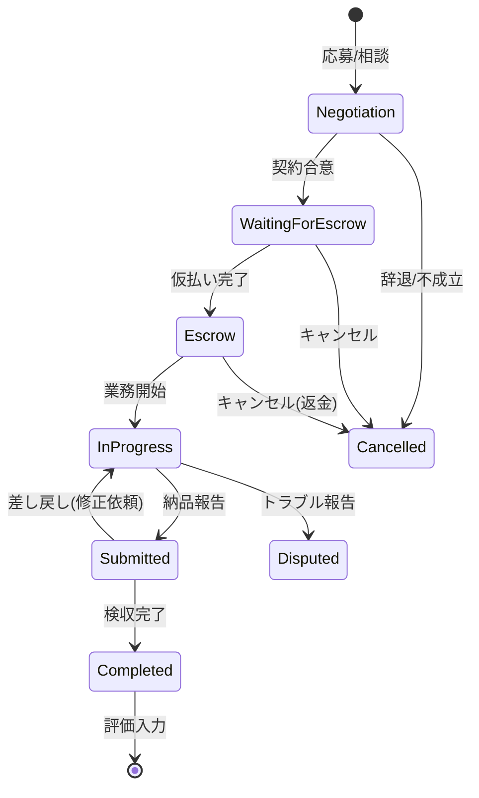
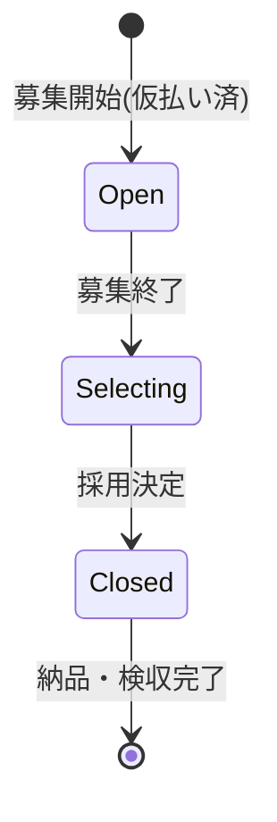
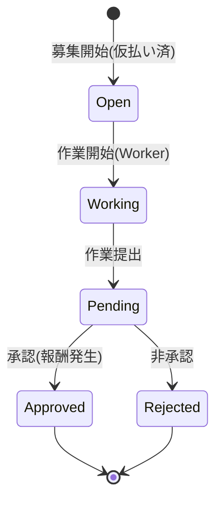

# クラウドソーシングプラットフォーム「Project Market Hub」詳細開発仕様書 (Ver 5.0)

## 1. プロジェクト定義 & コアコンセプト

### 1.1 概要
本プロジェクトは、クライアント（発注者）とワーカー（受注者）をマッチングするクラウドソーシングプラットフォーム**「Project Market Hub」**である。
最大の特徴は、**「単一アカウント・デュアルモード」**システムである。ユーザーはログアウトすることなく、ヘッダーのスイッチ一つで「クライアントモード」と「ワーカーモード」を瞬時に切り替えられる。

### 1.2 デザインシステム & UI規定
**コンセプト:** 「信頼 (Trust)」「清涼 (Clean)」「知性 (Intelligence)」
**デザイン原則:**
*   **余白の重視:** 情報過多になりがちな管理画面において、十分なパディングを取り、視認性を高める。
*   **明確なアクション:** 「次に何をすべきか」を色と配置で直感的に伝える。
*   **フィードバック:** ユーザーの操作（保存、送信、エラー）に対し、必ずトースト通知やローディング表示を行う。

**カラーパレット (Tailwind CSS):**
*   `primary`: `#00A3AF` (メインカラー: 爽やかな青緑) - アクションボタン、リンク、アクティブ状態
*   `primary-hover`: `#008C96`
*   `secondary`: `#0F2350` (アクセント: 濃紺) - ヘッダー、フッター、見出し、重要テキスト
*   `accent`: `#FF9F1C` (CTAボタン: オレンジ) - 契約、支払い、応募などのコンバージョンアクション
*   `danger`: `#EF4444` (削除・キャンセル・警告)
*   `background`: `#F9FAFB` (ベース背景色)
*   `surface`: `#FFFFFF` (カード・コンテンツ背景)
*   `text-body`: `#374151` (本文)
*   `text-muted`: `#6B7280` (補足情報)

**フォント:**
*   日本語: "Noto Sans JP", sans-serif
*   英語: "Inter", sans-serif

**コンポーネント:**
*   **Button:** `px-4 py-2 rounded-lg transition-all duration-200 font-medium shadow-sm active:scale-95`
*   **Card:** `bg-white rounded-xl shadow-sm border border-gray-100 p-6`
*   **Input:** `w-full rounded-lg border-gray-300 focus:border-primary focus:ring-primary`

---

## 1.3 サイトマップ & 画面遷移図 (Site Map & Navigation)

```text
[ Visitor / Unauthenticated ]
      |
      +-- Top Page (/)
      |     |
      |     +-- Login (/login) ------------------------+
      |     +-- Register (/register) ------------------|
      |                                                |
      v                                                v
[ Authenticated User ] <-----------------------( Auth Guard )
      |
      +-- [ Header: Mode Switcher (Client <-> Worker) ]
      |
      +-- [ Common Pages ]
      |     +-- Account Settings
      |     |     +-- Profile (/account/profile)
      |     |     +-- Verification (/account/verification)
      |     |     +-- Notifications (/account/notifications)
      |     +-- Messages (/messages)
      |           +-- Chat Room (/messages/[roomId])
      |
      +-- [ Client Mode ] (発注者)
      |     |
      |     +-- Dashboard (/client/dashboard)
      |     |
      |     +-- Job Management
      |     |     +-- Create New Job (/client/jobs/new) [Header Link]
      |     |     +-- Job List (/client/jobs)
      |     |     +-- Job Detail (/client/jobs/[id])
      |     |           +-- Edit Job
      |     |           +-- Applicant List (Project)
      |     |           +-- Proposal List (Competition)
      |     |           +-- Task Approvals (Task)
      |     |
      |     +-- Contract Management
      |           +-- Contract Detail (/client/contracts/[id])
      |                 +-- Payment (Escrow)
      |                 +-- Acceptance (Transfer)
      |
      +-- [ Worker Mode ] (受注者)
            |
            +-- Dashboard (/worker/dashboard)
            |
            +-- Job Search
            |     +-- Search (/worker/search)
            |     +-- Job Detail (/worker/jobs/[id])
            |           +-- Apply / Submit Proposal
            |
            +-- Contract Management
            |     +-- Application List (/worker/applications)
            |     +-- Contract Detail (/worker/contracts/[id])
            |           +-- Submit Deliverable
            |
            +-- Settings
                  +-- Public Profile (/account/worker/profile)
                  +-- Payout Settings (/account/worker/payout)
```

---

## 2. 業務フロー詳細設計 (Workflow Definitions)

### 2.0 システム全体フロー概要 (System Workflow Overview)

```text
                                    [ MONEY FLOW ]
                                          |
[ CLIENT ]                           [ PLATFORM ]                           [ WORKER ]
    |                                     |                                     |
    | (1) 募集 (Job Creation)             |                                     |
    |------------------------------------>|                                     |
    |                                     | (2) 検索・閲覧 (Search)             |
    |                                     |------------------------------------>|
    |                                     |                                     |
    |                                     | (3) 応募/提案 (Apply/Proposal)      |
    |<------------------------------------|-------------------------------------|
    |                                     |                                     |
    | (4) 契約/採用 (Contract/Adopt)      |                                     |
    |------------------------------------>|------------------------------------>|
    |                                     |                                     |
    | (5) 仮払い (Escrow Payment)         |                                     |
    |     [CREDIT CARD] --(Charge)------> | [STRIPE HOLDING]                    |
    |------------------------------------>| (Status: Escrow)                    |
    |                                     |------------------------------------>|
    |                                     |      (Notification: Start Work)     |
    |                                     |                                     |
    |                                     | (6) 業務・納品 (Work & Delivery)    |
    |<------------------------------------|-------------------------------------|
    |                                     |                                     |
    | (7) 検収 (Acceptance)               |                                     |
    |------------------------------------>|                                     |
    |                                     | (8) 本払い (Transfer Payment)       |
    |                                     | [STRIPE HOLDING] --(Transfer)-----> | [BANK ACCOUNT]
    |                                     | (Status: Completed)                 |
    |                                     |------------------------------------>|
    |                                     |                                     |
    | (9) 評価 (Review)                   | (9) 評価 (Review)                   |
    |------------------------------------>|<------------------------------------|
    v                                     v                                     v
```

CrowdWorksの仕様に準拠し、以下の3方式を実装する。**時間単価制は採用しない。**
全てのフローにおいて、**「エスクロー（仮払い）」**が必須であり、ワーカーの報酬未払いリスクを排除する。

### 2.1 プロジェクト方式（固定報酬制 - Fixed Price）
最も汎用的な形式。要件定義から納品まで、1対1（または1対多）で進行する。

#### 状態遷移図 (State Machine)


#### 詳細ステップ & 画面UI仕様

**Phase 1: マッチング (Matching)**
1.  **募集 (Client)**
    *   **Page:** `/client/jobs/new`
    *   **UI:**
        *   `JobForm`: タイトル、詳細(MDエディタ)、カテゴリ、予算、期限、添付ファイル入力。
        *   `SubmitButton`: 「公開する」
    *   **DB:** `jobs` 作成 (`status: 'open'`, `budgetType: 'fixed'`).
2.  **検索 & 応募 (Worker)**
    *   **Page:** `/worker/jobs/[id]`
    *   **UI:**
        *   `JobDetails`: 案件詳細表示。
        *   `ProposalForm`: 提示金額(税抜)、完了予定日、メッセージ入力エリア。
        *   `ApplyButton`: 「応募する」（未ログイン時はログインへ誘導）。
    *   **DB:** `proposals` 作成 (`status: 'pending'`).
3.  **条件交渉 (Both)**
    *   **Page:** `/messages/[roomId]`
    *   **UI:**
        *   `ChatBox`: メッセージ送受信。
        *   `ConditionPanel`: 現在の提示条件（金額・納期）を表示。
        *   `NegotiationActions`:
            *   **Client:** 「条件変更を提示」「この条件で契約する」ボタン。
            *   **Worker:** 「条件変更を提示」「同意する」ボタン。

**Phase 2: 契約 & 仮払い (Contract & Escrow)**
4.  **契約締結 (Client)**
    *   **Page:** `/messages/[roomId]` または `/client/jobs/[id]` (応募者一覧)
    *   **Action:** クライアントが最終条件で「契約する」ボタン押下。
    *   **DB:** `contracts` 作成 (`status: 'waiting_for_escrow'`).
    *   **Transition:** 画面は自動的に `/client/contracts/[id]` へ遷移する。
5.  **仮払い (Client)**
    *   **Page:** `/client/contracts/[id]`
    *   **UI:**
        *   `ContractStatus`: 「仮払い待ち」ステータス表示。
        *   `PaymentCard`: 請求額内訳（契約金額＋消費税）を表示。
        *   `PaymentButton`: **「仮払いへ進む（Stripe決済）」ボタン**。
            *   **Action:** このボタンをクリックすると、画面中央に `PaymentModal` (Stripe Elements) がオーバーレイ表示される。
            *   **Stripe Flow:**
                1.  クレジットカード情報を入力。
                2.  「支払う」ボタン押下。
                3.  Stripe API `PaymentIntent` (Separate Charges and Transfers) が実行され、プラットフォームが資金を預かる。
                4.  成功時、モーダルが閉じ、トースト通知「仮払いが完了しました」を表示。
                5.  画面リロードまたはステータス更新で「業務中（仮払い済み）」表示に切り替わる。
    *   **DB:** `contracts.status` → `'escrow'`.

**Phase 3: 業務 & 納品 (Work & Delivery)**
6.  **業務開始 (Worker)**
    *   **Page:** `/worker/contracts/[id]`
    *   **UI:**
        *   `ContractStatus`: 「業務中（仮払い済み）」表示。
        *   `DeliveryForm`:
            *   ファイルアップロード (Drag & Drop)。
            *   コメント入力エリア。
            *   `SubmitButton`: 「納品報告する」（`status === 'escrow'` 時のみ活性化）。
7.  **納品 (Worker)**
    *   **Action:** 納品報告ボタン押下。
    *   **DB:** `contracts.status` → `'submitted'`.

**Phase 4: 検収 & 支払い (Acceptance & Payment)**
8.  **検収 (Client)**
    *   **Page:** `/client/contracts/[id]`
    *   **UI:**
        *   `DeliveryPreview`: ワーカーが納品したファイル/URLとコメントを表示。
        *   `AcceptanceActions`:
            *   `RejectButton`: 「修正依頼（差し戻し）」
                *   クリックで理由入力モーダル表示 → 送信でステータスを `in_progress` へ戻す。
            *   `ApproveButton`: **「検収完了（支払い確定）」ボタン**。
                *   クリックで確認モーダル表示：「検収を完了しますか？これによりワーカーへの支払いが確定します。」
                *   「確定する」ボタン押下で `/api/contracts/complete` をコール。
    *   **System:** `/api/contracts/complete` (または `/api/stripe/capture-payment-intent`)。
        *   ※現状のコードベースでは `capture-payment-intent` が実装されているが、業務フロー的には `contracts/complete` が適切。
9.  **評価 (Both)**
    *   **Page:** `/client/contracts/[id]` / `/worker/contracts/[id]`
    *   **UI:**
        *   `ReviewModal`: 検収完了後に自動ポップアップ、または「評価を入力する」ボタンで表示。
        *   Star Rating (1-5) とコメント入力。

---

### 2.2 コンペ方式（Competition Format）
「ロゴ作成」や「ネーミング」など、多数の案から選びたい場合。
**特徴:** 募集開始時に「仮払い」を行い、採用決定時に「本払い」を行う。

#### 状態遷移図


#### 詳細ステップ & 画面UI仕様

1.  **募集作成 (Client)**
    *   **Page:** `/client/jobs/new`
    *   **UI:**
        *   `JobTypeSelector`: 「コンペ方式」を選択。
        *   `JobForm`: タイトル、詳細、カテゴリ、**契約金額（予算）**を入力。
        *   `ConfirmButton`: 「確認画面へ進む」ボタン。
2.  **仮払い & 公開 (Client)**
    *   **Page:** `/client/jobs/new/confirm` (または確認モーダル)
    *   **UI:**
        *   募集内容のプレビュー表示。
        *   `PaymentSection`: 「支払い金額：¥〇〇,〇〇〇（税込）」の表示。
        *   `PublishButton`: **「仮払いして募集を開始する」ボタン**。
            *   **Action:** クリックで `PaymentModal` (Stripe Elements) が表示される。
            *   **Stripe Flow:**
                1.  カード情報入力 → 支払い実行。
                2.  決済成功 (`PaymentIntent` 完了) をトリガーに、`jobs` データを `status: 'open'` で作成。
    *   **System:** 即時決済。資金はプラットフォームが預かる。
3.  **提案 (Worker)**
    *   **Page:** `/worker/jobs/[id]`
    *   **UI:**
        *   `ProposalForm`: 作品画像アップロード、提案コメント。
        *   `SubmitButton`: 「提案する」。
4.  **選定 & 採用 (Client)**
    *   **Page:** `/client/jobs/[id]`
    *   **UI:**
        *   `ProposalList`: 提案一覧。
        *   `AdoptButton`: 特定の提案詳細画面で**「この提案を採用する」ボタン**。
            *   確認モーダル：「この作品で確定しますか？（契約が作成され、納品フェーズへ移行します）」
    *   **DB:** `contracts` 作成 (`status: 'submitted'` - 納品待ち)。
5.  **納品 (Worker)**
    *   **Page:** `/worker/contracts/[id]` (採用後に生成される契約詳細ページ)
    *   **UI:**
        *   `DeliveryForm`: 「正式な納品データ（高解像度・透かしなし）」をアップロード。
        *   ※コンペの場合、提案時のデータで良ければスキップも可能だが、トラブル防止のため正式納品フローを挟む。
6.  **検収 & 本払い (Client)**
    *   **Page:** `/client/contracts/[id]`
    *   **UI:**
        *   `DeliveryCheck`: 正式データを確認。
        *   `CompleteButton`: **「検収完了（報酬支払い）」ボタン**。
    *   **System:** Stripe Transfer実行。採用されたワーカーへ送金される。
    *   **Refund:** 募集期間終了後、採用枠が埋まらなかった場合やキャンセル時は、残額をクライアントへRefundする。

---

### 2.3 タスク方式（Task Format）
「アンケート」や「データ入力」など、単純作業の大量発注。
**特徴:** 募集開始時に「総額（単価×件数）」を仮払いし、作業承認ごとに「本払い」を行う。

#### 状態遷移図


#### 詳細ステップ & 画面UI仕様

1.  **募集作成 (Client)**
    *   **Page:** `/client/jobs/new`
    *   **UI:**
        *   `JobTypeSelector`: 「タスク方式」を選択。
        *   `TaskBuilder`: 単価、件数、制限時間、設問フォームを作成。
        *   `BudgetPreview`: 合計金額（単価×件数＋消費税）の自動計算表示。
        *   `ConfirmButton`: 「確認画面へ進む」ボタン。
2.  **仮払い & 公開 (Client)**
    *   **Page:** `/client/jobs/new/confirm`
    *   **UI:**
        *   タスク内容と合計金額の確認。
        *   `PublishButton`: **「仮払いして募集を開始する」ボタン**。
            *   **Action:** クリックで `PaymentModal` (Stripe Elements) が表示される。
            *   **Stripe Flow:**
                1.  総額を決済 (`PaymentIntent`)。
                2.  決済成功後、`jobs` を `status: 'open'` で作成。
3.  **作業実施 (Worker)**
    *   **Page:** `/worker/jobs/[id]`
    *   **UI:**
        *   `StartButton`: 「作業を開始する」ボタン。
            *   クリックで作業画面へ遷移（`task_submissions` 作成、在庫確保）。
        *   `TaskWorkspace`: 制限時間内に回答を入力し、「作業を完了して提出する」ボタン押下。
4.  **承認 & 本払い (Client)**
    *   **Page:** `/client/jobs/[id]` (タスク管理タブ)
    *   **UI:**
        *   `SubmissionList`: 提出された作業の一覧。
        *   `ApproveButton`: 各行の**「承認」ボタン**。
            *   **Action:** クリックすると即座にその作業分の報酬（単価）がワーカーへ支払われる。
            *   **System:** `/api/tasks/approve` → Stripe Transfer実行（単価分のみ）。
        *   `RejectButton`: 「非承認」ボタン（理由入力必須）。報酬は支払われない。
5.  **完了 & 返金 (System)**
    *   **Trigger:** 募集期間終了、または全件承認完了。
    *   **System:** 未消化分の予算（非承認分や応募不足分）がある場合、クライアントへ `Refund` 処理を行う。

---

## 2.4 決済・仮払い詳細仕様 (Payment & Escrow Deep Dive)

本プラットフォームの核となる決済システムは、**Stripe Connect (Separate Charges and Transfers)** モデルを採用する。
これは、クライアントからの支払いを一度プラットフォームが受け取り（仮払い）、検収完了後にワーカーへ送金（本払い）する方式である。

### 採用理由とメリット
1.  **長期案件への対応:** 通常のオーソリ（`capture_method: manual`）は7日間で期限切れとなるため、数週間〜数ヶ月に及ぶプロジェクト方式には不向きである。一度決済を完了させプラットフォーム残高として保持することで、期間の制限なくエスクロー状態を維持できる。
2.  **柔軟な送金先:** コンペやタスク方式では、仮払い時点でワーカー（送金先）が未定である。プラットフォーム預かりとすることで、後から決定したワーカーへ送金が可能となる。
3.  **分割送金:** タスク方式のように、1つの仮払い（Charge）に対して複数のワーカーへ分割して送金（Transfer）することが可能。

### 金額計算シミュレーション (Financial Calculation)

**前提:**
*   **契約金額 (Contract Price):** 税抜きの本体価格。
*   **消費税 (Tax):** 10% (日本国内)。
*   **システム手数料 (Platform Fee):** 契約金額(税抜)の **5%** + 消費税。

| 項目 | 計算式 | 例: 10,000円の場合 | 備考 |
| :--- | :--- | :--- | :--- |
| **A. 契約金額 (税抜)** | User Input | **10,000 円** | |
| **B. 消費税 (10%)** | `A * 0.10` | 1,000 円 | |
| **C. クライアント支払総額** | `A + B` | **11,000 円** | **仮払い金額 (Charge Amount)** |
| **D. システム手数料 (税抜)** | `A * 0.05` | 500 円 | プラットフォーム収益 |
| **E. 手数料の消費税** | `D * 0.10` | 50 円 | |
| **F. システム手数料 (税込)** | `D + E` | 550 円 | |
| **G. ワーカー受取額** | `C - F` | **10,450 円** | **本払い金額 (Transfer Amount)** |

**検証:**
*   ワーカー視点: 10,000円(税抜)の仕事をして、11,000円(税込)を受け取る権利があるが、そこから手数料550円(税込)が引かれる。
*   `11,000 - 550 = 10,450`。整合性は取れている。

### Stripe API 実装詳細

#### 1. 仮払い (Charge / PaymentIntent)
クライアントが支払うフェーズ。

*   **API:** `stripe.paymentIntents.create`
*   **タイミング:**
    *   **プロジェクト:** 契約締結後、クライアントが「仮払い」ボタンを押した時。
    *   **コンペ/タスク:** 募集作成の最終確認画面で「公開」ボタンを押した時。
*   **パラメータ:**
    ```javascript
    {
      amount: 11000, // C. クライアント支払総額
      currency: 'jpy',
      payment_method_types: ['card'],
      transfer_group: '{jobId}', // 重要: 案件IDでグルーピングし、後で紐付ける
      metadata: {
        jobId: '{jobId}',
        contractId: '{contractId}', // プロジェクト方式の場合
        type: 'escrow'
      }
    }
    ```
*   **UI挙動:**
    *   `PaymentModal` (Stripe Elements) を表示。
    *   決済成功時、DBのステータスを更新 (`waiting_for_escrow` -> `escrow` / `open`)。

#### 2. 本払い (Transfer)
ワーカーへ報酬を移動するフェーズ。

*   **API:** `stripe.transfers.create`
*   **タイミング:**
    *   **プロジェクト:** クライアントが「検収完了」ボタンを押した時。
    *   **コンペ:** クライアントが「採用」を確定し、納品確認を完了した時。
    *   **タスク:** クライアントが作業を「承認」した時。
*   **前提条件 (Pre-conditions):**
    *   ワーカーの `stripeAccountId` が存在し、Onboarding (本人確認) が完了していること (`charges_enabled: true`)。
    *   プラットフォームのStripe残高が十分にあること。
*   **パラメータ:**
    ```javascript
    {
      amount: 10450, // G. ワーカー受取額
      currency: 'jpy',
      destination: '{workerStripeAccountId}', // ワーカーのConnect Account ID
      transfer_group: '{jobId}', // 仮払いと同じグループIDを指定
      metadata: {
        jobId: '{jobId}',
        contractId: '{contractId}',
        type: 'reward'
      }
    }
    ```
*   **UI挙動:**
    *   処理中はローディングスピナーを表示（二重送信防止）。
    *   完了後、トースト通知「支払いが完了しました」を表示し、画面をリロードまたはステータス更新。

#### 3. 返金 (Refund)
キャンセルや余剰予算の返還フェーズ。

*   **API:** `stripe.refunds.create`
*   **タイミング:**
    *   **プロジェクト:** 契約キャンセル合意時。
    *   **コンペ:** 募集期間終了後、採用なしの場合。
    *   **タスク:** 募集終了後、未消化予算がある場合。
*   **パラメータ:**
    ```javascript
    {
      payment_intent: '{paymentIntentId}', // 仮払い時のID
      amount: 5500, // 返金する金額（全額または一部）
      metadata: {
        jobId: '{jobId}',
        reason: 'cancellation'
      }
    }
    ```

### エラーハンドリングとリカバリー

1.  **決済失敗 (Card Error):**
    *   **原因:** 限度額オーバー、有効期限切れ、不正利用検知など。
    *   **UI:** Stripe Elementsが自動的にエラーメッセージを表示する。クライアントには別のカードでの試行を促す。
    *   **System:** DBの状態は変更しない（仮払い待ちのまま）。

2.  **送金失敗 (Transfer Error):**
    *   **原因:** ワーカーのStripeアカウント制限、本人確認未完了、プラットフォーム残高不足。
    *   **UI:** クライアントには「処理中にエラーが発生しました。運営にお問い合わせください」と表示。
    *   **System:**
        *   エラーログを記録（重要）。
        *   DBステータスは `disputed` または `transfer_failed` に変更し、管理者が手動で再送金できる管理画面を用意する。
        *   ワーカーへ「報酬受取口座の確認」を促すメールを自動送信。

3.  **整合性担保 (Idempotency):**
    *   Stripe API呼び出し時には `Idempotency-Key` (冪等キー) を付与し、ネットワークエラー等による二重決済・二重送金を確実に防ぐ。キーには `contractId` や `submissionId` を含める。

### 各方式における詳細フローとステータス遷移

#### A. プロジェクト方式（固定報酬）
1.  **仮払い:** 契約 (`contracts`) ごとに `PaymentIntent` を作成。
    *   Status: `waiting_for_escrow` -> `escrow`
    *   **Guard:** 仮払い完了まで、ワーカー側の「納品する」ボタンは **Disabled (非活性)** とする。
2.  **業務・納品:** ワーカーが納品。
    *   Status: `escrow` -> `submitted`
3.  **検収・本払い:** クライアントが検収。`Transfer` を実行。
    *   Status: `submitted` -> `completed`
    *   **Guard:** 検収完了後、クライアントは返金を要求できない（Stripe上もRefund不可とする）。
4.  **キャンセル:**
    *   **業務開始前:** 全額返金 (`Refund`)。
    *   **業務途中:** 話し合いにより決定した金額をワーカーへ `Transfer` し、残額をクライアントへ `Refund`。
    *   Status: `*` -> `cancelled`
    *   **Guard:** ワーカーが「納品済み」の場合、クライアント単独でのキャンセルは不可（ワーカーの合意アクションが必要）。

#### B. コンペ方式
1.  **仮払い:** 募集 (`jobs`) 作成時に予算全額を `PaymentIntent` で決済。
    *   Status: `draft` -> `open`
2.  **選定:** 募集終了後、採用作品を決定。
    *   Status: `open` -> `selecting`
3.  **採用・納品:** 採用ワーカーと契約作成。納品データを提出。
    *   Contract Status: `waiting_for_delivery` -> `submitted`
    *   **Guard:** 採用決定ボタン押下時、確認モーダルで「採用により契約が成立し、支払い義務が発生します」と明示。
4.  **検収・本払い:** 納品データ確認後、採用ワーカーへ `Transfer`。
    *   Contract Status: `submitted` -> `completed`
    *   Job Status: `selecting` -> `closed`
5.  **返金:**
    *   募集終了時、`仮払い額 - 送金済み総額` を計算し、残額があれば自動的に `Refund` 処理を行うバッチを実行。

#### C. タスク方式
1.  **仮払い:** 募集 (`jobs`) 作成時に `単価 × 件数` の総額を `PaymentIntent` で決済。
    *   Status: `draft` -> `open`
2.  **作業:** ワーカーが作業提出。
    *   Submission Status: `working` -> `pending`
    *   **Guard:** 同一ワーカーによる連続投稿制限（短時間の大量投稿はBotの可能性があるため、reCAPTCHA等で対策）。
3.  **承認・本払い:**
    *   クライアントが1件承認するごとに、その作業のワーカーへ `単価` 分を `Transfer`。
    *   即時性が求められるため、承認ボタン押下時に同期的にAPIをコールする。
    *   Submission Status: `pending` -> `approved`
    *   **Guard:** 一度「承認」した作業は取り消し不可。
4.  **返金:**
    *   募集終了時、またはクライアントによる早期終了時、`仮払い額 - 承認済み総額` を計算し、残額を `Refund`。
    *   Job Status: `open` -> `closed`

---

## 2.5 不正防止・トラブル対策 (Security & Anti-Fraud)

ユーザー目線での「抜け道」やリスクを排除するためのシステム的対策。

### 1. 直接取引（中抜き）の防止
*   **リスク:** メッセージ機能で連絡先を交換し、手数料を回避して直接取引を行う。
*   **対策:**
    *   **NGワード検知:** メッセージ内で「メールアドレス」「電話番号」「LINE ID」「@」などのパターンを検知し、送信前に警告モーダルを表示。「外部連絡先の交換は規約違反です」と警告する。
    *   **監視:** 検知されたメッセージは管理画面でフラグを立て、運営が目視確認できるようにする。

### 2. 仮払い前の業務強要（持ち逃げ）防止
*   **リスク:** クライアントが「後で払うから」と作業をさせ、納品物だけ受け取って支払わない。
*   **対策:**
    *   **システム制御:** ステータスが `escrow` (仮払い済み) になるまで、ワーカー側の画面には「納品フォーム」を表示しない（または非活性化）。
    *   **UI警告:** チャット画面や契約詳細画面に「仮払いが完了するまで、絶対に業務を開始しないでください」という警告帯を常時表示する。

### 3. 納品データの持ち逃げ防止
*   **リスク:** クライアントが納品ファイルをダウンロードした後、不当に検収を拒否・キャンセルする。
*   **対策:**
    *   **キャンセル制限:** ステータスが `submitted` (納品済み) の場合、クライアント側からのキャンセルボタンを非表示にする。キャンセルするには「トラブル報告」を行い、ワーカーの合意または運営の介入を必須とする。
    *   **透かし (Watermark):** コンペの提案段階などの画像には、自動的に「SAMPLE」等の透かしを入れる処理を検討（将来実装）。

### 4. タスク方式の不当な非承認
*   **リスク:** 成果物を利用しつつ「非承認」にして報酬を支払わない。
*   **対策:**
    *   **理由必須:** 非承認にする際は、必ず理由を選択または入力させる。
    *   **非承認率の可視化:** クライアントのプロフィールに「タスク承認率」を表示し、ワーカーがブラックなクライアントを避けられるようにする。

### 5. マネーロンダリング・自作自演対策
*   **リスク:** 不正な資金移動や、評価の水増し。
*   **対策:**
    *   **本人確認:** 報酬を受け取るワーカーだけでなく、高額発注を行うクライアントにもStripe Identityによる本人確認を求める場合がある。
    *   **同一性チェック:** 発注者と受注者のIPアドレスやデバイス指紋が一致する場合、警告または取引ブロックを行う。

---

## 2.6 メッセージ機能詳細 (Messaging System Deep Dive)

### 1. 基本仕様
*   **形式:** 1対1のチャットルーム形式（案件ごとのルーム、またはユーザー間のダイレクトメッセージ）。
*   **リアルタイム性:** Firestoreの `onSnapshot` を利用したリアルタイム更新。

### 2. 既読管理 (Read Status)
*   **ロジック:**
    *   メッセージドキュメントに `readBy: string[]` フィールドを持たせる。
    *   受信者がチャットルームを開いた（`useEffect` で検知）時点で、未読メッセージの `readBy` に自身のIDを追加する更新を行う。
    *   送信者側には、相手が既読にしたメッセージに対して「既読」マークを表示する。

### 3. ファイル添付 (File Attachment)
*   **制限:**
    *   サイズ: 1ファイルあたり最大 **100MB**。
    *   形式: 画像(jpg, png, gif), ドキュメント(pdf, doc, docx, xls, xlsx, ppt, pptx), 圧縮ファイル(zip, rar)。
    *   実行ファイル(exe, bat等)はセキュリティリスクのため禁止。
*   **保存先:** Firebase Storage (`/messages/{roomId}/{fileId}`).
*   **UI:** ドラッグ＆ドロップ対応。アップロード中はプログレスバーを表示。

### 4. システムメッセージ (System Messages)
*   **定義:** ユーザーが入力したテキストではなく、システムが自動投稿する通知メッセージ。
*   **トリガー:**
    *   契約締結時：「契約が締結されました。仮払いをお待ちください。」
    *   仮払い完了時：「仮払いが完了しました。業務を開始してください。」
    *   納品時：「ワーカーから納品報告がありました。検収を行ってください。」
    *   検収完了時：「検収が完了しました。お疲れ様でした。」
*   **表示:** 通常のメッセージとは異なるスタイル（背景色変更、中央寄せ等）で表示し、区別する。

### 5. 通知連携
*   **メール通知:** メッセージ受信から **5分間** 既読にならなかった場合、受信者の登録メールアドレスへ「新着メッセージのお知らせ」を送信する（即時送信だとチャット中に大量のメールが届くため、デバウンス処理を入れる）。

---

## 2.7 評価システム詳細 (Rating System Deep Dive)

### 1. 評価項目 (Criteria)
5段階評価（1: 悪い 〜 5: 非常に良い）。

| 項目 | 対象 | 説明 |
| :--- | :--- | :--- |
| **品質 (Quality)** | Worker | 納品物のクオリティ、要件満たし度。 |
| **納期 (Schedule)** | Worker | スケジュール遵守、レスポンス速度。 |
| **コミュニケーション (Communication)** | Both | やり取りの円滑さ、丁寧さ。 |
| **パートナーシップ (Partnership)** | Client | 要件の明確さ、支払いのスムーズさ。 |

### 2. 総合評価の計算ロジック
*   **計算式:** `(各項目の平均点) の平均` を算出。
    *   例: 品質4, 納期5, コミュニケーション5 => (4+5+5)/3 = 4.66... -> **4.7**
*   **ユーザー全体の評価:** 直近100件（または全期間）の取引における総合評価の平均値。
*   **表示:** 小数点第1位まで表示（例: ★4.5）。

### 3. 評価の公開タイミング (Double-Blind System)
*   **相互評価方式:**
    *   片方が評価を入力しても、相手にはまだ内容は公開されない（「評価済み」ステータスのみ伝わる）。
    *   **双方が評価を入力した時点**、または **評価期限（検収から1ヶ月後）が過ぎた時点** で、両者の評価がプロフィールに公開される。
    *   これにより、報復評価（低い評価を付けられたから低く付け返す行為）を防ぐ。

### 4. 評価の修正
*   **原則不可:** 一度確定した評価は修正できない。
*   **例外:** 誹謗中傷や個人情報が含まれる場合など、運営が不適切と判断した場合のみ削除・修正を行う。

---

## 2.8 キャンセルポリシー詳細 (Cancellation Policy Deep Dive)

### 1. フェーズ別キャンセル規定

| フェーズ | キャンセル可否 | 手数料・返金 | 備考 |
| :--- | :--- | :--- | :--- |
| **契約前** | 自由 | 発生しない | 応募辞退、募集取り下げは自由。 |
| **契約後・仮払い前** | 可能 | 発生しない | 相手へのメッセージ通知必須。自動キャンセル機能あり（1週間放置等）。 |
| **仮払い後・業務開始前** | 可能 | **全額返金** | クライアント・ワーカー双方の合意が必要。システム手数料も返還される（Stripe仕様に準拠）。 |
| **業務開始後・納品前** | 条件付き可能 | **部分返金** | 進捗に応じた金額をワーカーへ支払い、残額を返金。**システム手数料は「支払い額」に対してのみ発生**。 |
| **納品後・検収前** | **原則不可** | - | 成果物が完成しているため、一方的なキャンセルは不可。品質に問題がある場合は「修正依頼」を行う。どうしても合意に至らない場合は運営介入。 |
| **検収完了後** | **不可** | - | 決済確定後のキャンセル・返金はシステム上行わない。当事者間で解決する。 |

### 2. 連絡不通時の自動処理 (Auto-Cancellation)
*   **ワーカー連絡不通:** 業務期間中にワーカーからの連絡が **7日間** 途絶え、クライアントから「連絡不通申請」があった場合、運営が確認のうえ契約を途中終了（キャンセル）し、全額返金とする。
*   **クライアント連絡不通:** 納品後、クライアントからの検収・連絡が **14日間** 途絶えた場合、**自動検収** とみなし、ワーカーへ報酬を支払う。

---

## 2.9 管理画面機能要件 (Admin Dashboard Requirements)

運営者がプラットフォームを健全に保つための管理機能。`/admin/*` 配下に配置し、特定の管理者権限を持つユーザーのみアクセス可能とする。

### 1. ユーザー管理 (User Management)
*   **一覧・検索:** UID、メールアドレス、氏名、ステータスで検索可能。
*   **詳細確認:** 登録情報、本人確認書類（Stripe Identity連携）、Stripe Connect ID、評価、取引履歴の閲覧。
*   **アクション:**
    *   **アカウント凍結/解除:** 規約違反ユーザーのログイン停止。
    *   **強制退会:** アカウント削除。
    *   **本人確認手動承認:** Stripe Identityで判定不能だった場合の目視確認・承認/否認。

### 2. 案件・契約管理 (Job & Contract Management)
*   **案件監視:** 新規投稿された案件の一覧。不適切な案件（公序良俗違反、マルチ商法等）の**非公開化・削除**。
*   **契約介入:** トラブル発生中の契約詳細確認。メッセージログの閲覧。
*   **強制キャンセル・返金:** 当事者間で解決しない場合、管理権限で契約をキャンセルし、Stripe APIを通じて**強制返金 (Refund)** または **強制送金 (Transfer)** を実行する。

### 3. 通報管理 (Report Management)
*   **通報一覧:** ユーザーから寄せられた通報（メッセージ、案件、プロフィール）の一覧。
*   **対応ステータス:** `未対応` -> `確認中` -> `対応済み` / `却下` の管理。

### 4. 売上・出金管理 (Financial Management)
*   **売上集計:** 日次・月次の取扱高（GMV）、プラットフォーム収益（Net Revenue）のグラフ表示。
*   **Stripe残高確認:** プラットフォーム口座の残高確認（送金資金不足のアラート）。

---

## 2.10 バッチ処理・自動化 (Scheduled Functions)

Cloud Functions for Firebase (Pub/Sub Scheduler) を利用した定期実行処理。

### 1. 募集期限切れチェック (Daily)
*   **対象:** `status: 'open'` かつ `deadline < now` の案件。
*   **処理:** ステータスを `closed` (募集終了) に更新し、クライアントへ通知メールを送信。
*   **返金:** コンペ・タスク方式で仮払い済みの予算がある場合、自動的に `Refund` 処理を実行。

### 2. 自動検収処理 (Daily)
*   **対象:** `status: 'submitted'` (納品済み) かつ `submittedAt < 14 days ago` の契約。
*   **処理:**
    1.  クライアントへ最終警告メール送信（3日前など）。
    2.  期限到来時、自動的に `status: 'completed'` に更新。
    3.  Stripe `Transfer` APIを実行し、ワーカーへ報酬を支払う。
    4.  システムメッセージ：「クライアントからの連絡がなかったため、規定により自動検収としました。」

### 3. 未読メッセージ通知 (Every 15 mins)
*   **対象:** `read: false` かつ `createdAt > 15 mins ago` のメッセージがあり、まだ通知メールを送っていないユーザー。
*   **処理:** 「新着メッセージがあります」というメールを送信し、`emailSent: true` フラグを立てる（連続送信防止）。

---

## 3. アカウント・マイページ詳細仕様 (Account & Personal Page Specs)

CrowdWorksのマイページ構成をベースに、本プラットフォーム独自の「デュアルモード」を統合した設計とする。
ユーザーは「共通設定」「ワーカー設定」「クライアント設定」の3つのカテゴリで情報を管理する。

### 3.1 画面構成 (UI Structure)
*   **レイアウト:** 左サイドバーに設定メニュー、右側に編集フォームを配置する2カラムレイアウト。
*   **レスポンシブ:** モバイル時はハンバーガーメニューまたはドロップダウンでメニューを表示。

### 3.2 メニュー項目一覧 (Navigation Menu)

#### A. 共通設定 (Common Settings)
1.  **基本情報編集 (Basic Info)**
    *   氏名、住所、電話番号などの個人情報。契約書面や本人確認の基礎となる重要情報。
2.  **メールアドレス・パスワード (Email & Security)**
    *   ログイン情報の変更。
3.  **本人確認書類提出 (Identity Verification)**
    *   身分証のアップロードとステータス確認。信頼性向上のため必須推奨。
4.  **通知設定 (Notifications)**
    *   メール通知、プッシュ通知のON/OFF。
5.  **退会申請 (Delete Account)**
    *   アカウント削除フロー。

#### B. ワーカー設定 (Worker Settings)
1.  **ワーカープロフィール (Public Profile)**
    *   表示名、職種、スキル、自己紹介。クライアントに公開される情報。
2.  **スキル・ポートフォリオ (Skills & Portfolio)**
    *   実績や作品の登録。
3.  **報酬振込先 (Payout Settings)**
    *   Stripe Connectアカウント管理画面へのリンク。

#### C. クライアント設定 (Client Settings)
1.  **クライアントプロフィール (Company Profile)**
    *   会社名、事業内容、URL。ワーカーに公開される情報。
2.  **支払い方法 (Payment Methods)**
    *   クレジットカード管理 (Stripe Customer Portal)。

---

### 3.3 詳細フィールド定義 (Field Definitions)

#### (1) 基本情報編集 (`/account/profile`)
**目的:** 契約や本人確認に使用する正式な情報を登録する。非公開。

| 項目名 | 必須 | 型 | 制約/備考 |
| :--- | :---: | :--- | :--- |
| **氏名 (漢字)** | 必須 | String | 全角。本人確認書類と一致すること。 |
| **氏名 (カナ)** | 必須 | String | 全角カタカナ。口座名義と一致すること。 |
| **生年月日** | 必須 | Date | **登録後変更不可**。未成年チェックに使用。 |
| **性別** | 任意 | Enum | 男性/女性/その他/無回答 |
| **郵便番号** | 必須 | String | 7桁 (ハイフンなし可)。**zipcloud API** を利用して住所自動補完を行う。 |
| **都道府県** | 必須 | Select | 47都道府県。 |
| **市区町村・番地** | 必須 | String | |
| **建物名・部屋番号** | 任意 | String | |
| **電話番号** | 必須 | String | ハイフンなし。将来的にSMS認証に使用。 |

#### (2) ワーカープロフィール (`/account/worker/profile`)
**目的:** クライアントにアピールするための公開情報。

| 項目名 | 必須 | 型 | 制約/備考 |
| :--- | :---: | :--- | :--- |
| **表示名** | 必須 | String | ニックネーム可。デフォルトは氏名。 |
| **キャッチコピー** | 必須 | String | 最大50文字。検索結果に表示される。 |
| **職種** | 必須 | Select | エンジニア/デザイナー/ライター等 (大カテゴリ > 小カテゴリ)。 |
| **自己紹介** | 必須 | Text | Markdown対応。最大3000文字。 |
| **稼働可能時間** | 必須 | Select | 週10時間未満 / 10-20時間 / 20-30時間 / 30時間以上 |
| **希望単価** | 任意 | Number | 時給換算の目安 (円)。 |

#### (3) 本人確認 (`/account/verification`)
**目的:** 信頼性担保。Stripe Identityを利用して本人確認を行う。
**仕様:** **Stripe Identity**を利用した自動本人確認フローを採用する。

*   **API:** `/api/identity/create-verification-session`
*   **ステータス:**
    *   `unsubmitted`: 未提出
    *   `pending`: 審査中 (Stripeにて処理中)
    *   `approved`: 承認済み (バッジ付与)
    *   `rejected`: 否認 (再提出が必要)
*   **UIフロー:**
    1.  「本人確認を開始する」ボタンをクリック。
    2.  APIをコールし、Stripe Verification Sessionを作成。
    3.  返却されたURLへリダイレクト（またはリンク表示）。
    4.  ユーザーがStripe上で書類（免許証、マイナンバーカード等）とセルフィーを提出。
    5.  完了後、元のページへ戻る。
    6.  StripeからのWebhook (`identity.verification_session.verified` 等) を受けてステータスを更新。
*   **表示:**
    *   審査中: 「現在、提出された書類を確認しています。」
    *   承認済み: 「本人確認済み」バッジ表示。
    *   否認: 理由（`verificationRejectionReason`）を表示し、再提出を促す。

#### (4) 報酬振込先 (`/account/worker/payout`)
**仕様:** Stripe Connect (Express) を使用するため、直接口座情報は保持しない。
*   **UI:** 「Stripeアカウントを確認・編集する」ボタンを配置。
*   **挙動:** クリックすると Stripe Hosted Dashboard へリダイレクトする。
*   **ステータス表示:** 「連携済み」「未連携」「情報不足」等のStripeアカウント状態を表示する。

#### (5) 通知設定 (`/account/notifications`)
**仕様:** 各種イベントごとのメール送信可否設定。

| 項目名 | デフォルト | 説明 |
| :--- | :---: | :--- |
| **重要なお知らせ** | ON (固定) | 運営からの重要連絡。OFF不可。 |
| **メッセージ受信** | ON | クライアント/ワーカーからのメッセージ。 |
| **契約・業務連絡** | ON | 契約締結、仮払い、検収等の通知。 |
| **スカウトメール** | ON | クライアントからのスカウト。 |
| **デイリーサマリー** | OFF | おすすめ案件などのまとめメール。 |

---

## 4. データベース設計 (Firestore Schema)

NoSQLの特性を活かし、読み取り最適化（非正規化）を行う。

### `users` (Collection)
ユーザーの基本情報。
```typescript
interface User {
  uid: string;                 // Auth UID
  email: string;
  displayName: string;         // ワーカー表示名 (ニックネーム)
  photoURL: string;
  userType: 'client' | 'worker' | 'both';
  createdAt: Timestamp;
  updatedAt: Timestamp;
  
  // Personal Info (Private - for Verification & Contracts)
  name?: string;               // 本名 (漢字)
  nameKana?: string;           // 本名 (カナ)
  birthDate?: string;          // YYYY-MM-DD
  gender?: string;
  address?: {
    postalCode: string;
    prefecture: string;
    city: string;
    building?: string;
  };
  phoneNumber?: string;
  
  // Verification
  verificationStatus: 'unsubmitted' | 'pending' | 'approved' | 'rejected';
  verificationRejectionReason?: string;
  identityDocumentUrls?: string[]; // [front, back] (Admin only)

  // Stripe Connect
  stripeAccountId?: string;    // Worker: Express Account ID (acct_...)
  stripeCustomerId?: string;   // Client: Customer ID (cus_...)
  stripeOnboardingComplete: boolean;

  // Profiles
  clientProfile?: {
    companyName?: string;
    description?: string;
    website?: string;
  };
  workerProfile?: {
    title: string;             // キャッチコピー e.g. "Frontend Developer"
    bio: string;               // 自己紹介
    skills: string[];          // e.g. ["React", "TypeScript"]
    portfolioUrls?: string[];
    hoursPerWeek?: string;     // 稼働可能時間
    desiredUnitPrice?: number; // 希望単価
  };

  // Notification Settings
  notificationSettings?: {
    emailMessage: boolean;
    emailContract: boolean;
    emailScout: boolean;
    emailDaily: boolean;
  };

  // Stats (Denormalized)
  rating: number;              // 0.0 - 5.0
  reviewCount: number;
  jobsCompleted: number;
}
```

### `jobs` (Collection)
案件情報。
```typescript
interface Job {
  id: string;
  clientId: string;
  clientName: string;          // 非正規化
  clientPhotoURL: string;      // 非正規化
  
  title: string;
  description: string;         // Markdown
  category: string;            // e.g. "development", "design"
  tags: string[];
  
  type: 'project' | 'competition' | 'task';
  budgetType: 'fixed';         // 固定報酬のみ
  budget: number;              // 予算目安
  deadline: Timestamp;         // 募集期限
  
  status: 'open' | 'selecting' | 'closed' | 'filled' | 'cancelled';
  
  // Type specific data
  competition?: {
    guaranteed: boolean;       // 採用確約
    additionalPrizes?: number[];
  };
  task?: {
    unitPrice: number;
    quantity: number;
    timeLimit: number;         // 分単位
    questions: {
      id: string;
      type: 'text' | 'radio' | 'checkbox';
      text: string;
      options?: string[];
      required: boolean;
    }[];
  };

  createdAt: Timestamp;
  updatedAt: Timestamp;
  proposalCount: number;       // 非正規化カウンター
}
```

### `proposals` (Collection)
応募・提案情報。
```typescript
interface Proposal {
  id: string;
  jobId: string;
  clientId: string;            // クエリ用
  workerId: string;
  
  // Worker Info (Denormalized)
  workerName: string;
  workerPhotoURL: string;
  
  // Proposal Content
  price: number;               // 提案金額 (税抜)
  message: string;
  estimatedDuration: string;   // e.g. "1 week"
  attachments: string[];       // ファイルURL
  
  status: 'pending' | 'interviewing' | 'rejected' | 'hired' | 'adopted';
  
  // Negotiation History
  negotiationHistory: {
    senderId: string;
    price: number;
    message: string;
    createdAt: Timestamp;
  }[];

  createdAt: Timestamp;
  updatedAt: Timestamp;
}
```

### `contracts` (Collection)
契約・取引情報。**最重要コレクション。**
```typescript
interface Contract {
  id: string;
  jobId: string;
  clientId: string;
  workerId: string;
  
  // Snapshot
  jobTitle: string;
  jobType: 'project' | 'competition' | 'task';
  
  // Financials
  amount: number;              // 契約金額 (税抜)
  tax: number;                 // 消費税 (amount * 0.1)
  totalAmount: number;         // 税込請求額 (amount + tax)
  platformFee: number;         // 手数料 (amount * 0.05)
  workerReceiveAmount: number; // ワーカー受取額 (amount - platformFee)
  
  // Status
  status: 
    | 'waiting_for_escrow' // 仮払い待ち
    | 'escrow'             // 仮払い済み・作業待ち
    | 'in_progress'        // 作業中（修正対応含む）
    | 'submitted'          // 納品確認中
    | 'disputed'           // トラブル中
    | 'completed'          // 検収完了・支払済
    | 'cancelled';         // キャンセル

  // Stripe
  stripePaymentIntentId: string;
  stripeTransferId?: string;
  
  // Delivery
  deliveryFileUrl?: string;
  deliveryMessage?: string;
  
  createdAt: Timestamp;
  escrowAt?: Timestamp;
  submittedAt?: Timestamp;
  completedAt?: Timestamp;
}
```

### `task_submissions` (Collection)
タスク方式の作業提出データ。
```typescript
interface TaskSubmission {
  id: string;
  jobId: string;
  workerId: string;
  
  answers: {
    questionId: string;
    value: string | string[];
  }[];
  
  status: 'working' | 'pending' | 'approved' | 'rejected';
  rejectionReason?: string;
  
  startedAt: Timestamp;
  submittedAt?: Timestamp;
  reviewedAt?: Timestamp;
}
```

---

## 5. システム機能要件 (System Requirements)

### 5.1 認証・認可 (Authentication)
*   **Middleware:** `/client/*` および `/worker/*` へのアクセスは認証済みユーザーのみ許可。未認証は `/login` へリダイレクト。
*   **Role Check:** ユーザータイプによる制限は設けない（全員がClientかつWorkerになれるため）。ただし、プロフィール未入力時のガードは設ける。

### 5.2 モード管理 (Mode Management)
*   **Context:** `ModeContext` で `currentMode` ('client' | 'worker') を管理。
*   **Persistence:** `localStorage` に保存し、リロード後も維持。
*   **UI:** ヘッダーの色、メニュー項目、ダッシュボードの表示内容をモードに応じて完全に切り替える。
*   **Header Actions:**
    *   **ログイン中:** 「ログアウト」ボタンを表示する。
    *   **ログアウト中:** 「ログイン」ボタンを表示する。

### 5.3 決済システム (Payment System)
*   **Stripe Connect:** Expressアカウントを使用。
*   **Onboarding:** ワーカーが報酬を受け取るには、Stripeの本人確認プロセス（Onboarding）を完了させる必要がある。完了していない場合、応募・受注をブロックする。
*   **Webhook:** Stripeからのイベント (`payment_intent.succeeded`, `payment_intent.payment_failed`) をCloud Functionsで受け取り、DB整合性を保つ（バックアップ手段として）。基本はクライアントサイドからのAPIコールで状態遷移させるが、Webhookは必須。

### 5.4 通知システム (Notifications)
*   **Trigger:** 状態遷移時（応募、契約、仮払い、納品、検収）。
*   **Channel:**
    1.  **In-App:** ヘッダーのベルアイコン。`notifications` コレクションに書き込み。
    2.  **Email:** SendGrid または Firebase Extensions (Trigger Email) を使用してメール送信。

---

## 6. ディレクトリ構造 (Directory Structure)

```
src/
├── app/
│   ├── (auth)/                  # 認証グループ
│   │   ├── login/page.tsx
│   │   └── register/page.tsx
│   ├── (main)/                  # メインアプリグループ
│   │   ├── layout.tsx           # Header, ModeProvider
│   │   ├── client/              # クライアント機能
│   │   │   ├── dashboard/       # ダッシュボード
│   │   │   ├── jobs/            # 案件管理
│   │   │   │   ├── new/         # 新規作成
│   │   │   │   └── [id]/        # 詳細・編集
│   │   │   ├── contracts/       # 契約管理
│   │   │   │   └── [id]/        # 契約詳細・決済・検収
│   │   │   └── workers/         # ワーカー検索
│   │   ├── worker/              # ワーカー機能
│   │   │   ├── dashboard/
│   │   │   ├── search/          # 仕事検索
│   │   │   ├── applications/    # 応募管理
│   │   │   └── contracts/       # 契約詳細・納品
│   │   └── messages/            # メッセージ機能
│   │       └── [roomId]/
│   └── api/                     # API Routes
│       └── webhooks/
│           └── stripe/route.ts
├── components/
│   ├── ui/                      # 基本UIパーツ (Button, Card, Input...)
│   ├── layouts/                 # Header, Footer
│   ├── features/                # 機能別コンポーネント
│   │   ├── job/                 # JobCard, JobForm
│   │   ├── contract/            # ContractStatus, PaymentButton
│   │   └── message/             # ChatBox
│   └── providers/               # AuthProvider, ModeProvider
├── lib/
│   ├── firebase.ts              # Firebase Config
│   ├── db.ts                    # Firestore Utils
│   ├── stripe.ts                # Stripe Utils
│   └── utils.ts                 # Helper Functions
├── types/                       # TypeScript Definitions
└── hooks/                       # Custom Hooks
```

---

## 7. セキュリティルール (Security Rules)

Firestore Security Rulesの概要。

*   `users`: 本人のみ書き込み可。公開プロフィール部分は誰でも読み取り可。
*   `jobs`: クライアントのみ作成・更新可。読み取りは誰でも可。
*   `proposals`: 作成はワーカーのみ。読み取りは当該クライアントと作成者のみ。
*   `contracts`: 当該クライアントとワーカーのみ読み書き可。
*   `task_submissions`: 作成はワーカーのみ。読み取りは当該クライアントと作成者のみ。

---

## 8. 付録: 特定商取引法に基づく表記

| 項目 | 内容 |
| :--- | :--- |
| **販売事業者** | 山本健太 |
| **運営責任者** | 山本健太 |
| **所在地** | 〒600-8208 京都府京都市下京区小稲荷町85-2 Grand-K 京都駅前ビル 201 |
| **連絡先メールアドレス** | service@meeting-agency.com |
| **電話番号** | 請求があった場合、遅滞なく開示します。 |
| **サイトURL** | https://project-market-hub.com/ |
| **販売価格** | 各商品・サービスのご購入ページにて表示する価格 |
| **商品代金以外の必要料金** | インターネット接続料金、通信料金等はお客様の負担となります。 |
| **支払方法** | クレジットカード決済 (Stripe)、銀行振込 |
| **支払時期** | **固定報酬制:** 契約締結時に仮払い（与信枠確保）、検収完了時に決済確定。<br>**タスク方式:** 募集開始時に仮払い、承認完了時に決済確定。<br>**コンペ方式:** 募集開始時に仮払い、採用決定時に決済確定。 |
| **引渡し時期** | 決済完了後、即時（サービス利用開始） |
| **返品・交換・キャンセル** | デジタルコンテンツの性質上、原則として返品・返金には応じられません。<br>ただし、当社の責めに帰すべき事由によりサービスが提供されなかった場合はこの限りではありません。<br>契約キャンセル時の返金については利用規約に準じます。 |

---

## 9. 利用規約 (Terms of Service)

本利用規約（以下「本規約」といいます。）は、山本健太（以下「運営者」といいます。）が提供する「Project Market Hub」（以下「本サービス」といいます。）の利用条件を定めるものです。登録ユーザーの皆様（以下「ユーザー」といいます。）には、本規約に従って本サービスをご利用いただきます。

### 第1条 (適用)
1. 本規約は、ユーザーと運営者との間の本サービスの利用に関わる一切の関係に適用されるものとします。
2. 運営者は本サービスに関し、本規約のほか、ご利用にあたってのルール等、各種の定め（以下「個別規定」といいます。）をすることがあります。これら個別規定はその名称のいかんに関わらず、本規約の一部を構成するものとします。
3. 本規約の規定が前項の個別規定の規定と矛盾する場合には、個別規定において特段の定めなき限り、個別規定の規定が優先されるものとします。

### 第2条 (定義)
本規約において使用する用語の定義は、以下のとおりとします。
1. **「本サービス」**: 運営者が運営する「Project Market Hub」と称するウェブサイトおよび関連サービス。
2. **「ユーザー」**: 本サービスを利用するために会員登録を行った個人または法人。
3. **「クライアント」**: 本サービスを通じて業務を依頼するユーザー。
4. **「ワーカー」**: 本サービスを通じて業務を受託するユーザー。
5. **「本取引」**: 本サービスを通じてクライアントとワーカーの間で締結される業務委託契約。
6. **「仮払い」**: クライアントがワーカーに対する報酬を、運営者が指定する決済サービスを通じて一時的に預け入れること。

### 第3条 (利用登録)
1. 登録希望者が運営者の定める方法によって利用登録を申請し、運営者がこれを承認することによって、利用登録が完了するものとします。
2. 運営者は、利用登録の申請者に以下の事由があると判断した場合、利用登録の申請を承認しないことがあり、その理由については一切の開示義務を負わないものとします。
    *   虚偽の事項を届け出た場合
    *   本規約に違反したことがある者からの申請である場合
    *   その他、運営者が利用登録を相当でないと判断した場合

### 第4条 (ユーザーIDおよびパスワードの管理)
1. ユーザーは、自己の責任において、本サービスのユーザーIDおよびパスワードを適切に管理するものとします。
2. ユーザーは、いかなる場合にも、ユーザーIDおよびパスワードを第三者に譲渡または貸与し、もしくは第三者と共用することはできません。
3. 運営者は、ユーザーIDとパスワードの組み合わせが登録情報と一致してログインされた場合には、そのユーザーIDを登録しているユーザー自身による利用とみなします。

### 第5条 (禁止事項)
ユーザーは、本サービスの利用にあたり、以下の行為をしてはなりません。
1. 法令または公序良俗に違反する行為
2. 犯罪行為に関連する行為
3. 本サービスの内容等、本サービスに含まれる著作権、商標権ほか知的財産権を侵害する行為
4. 運営者、ほかのユーザー、またはその他第三者のサーバーまたはネットワークの機能を破壊したり、妨害したりする行為
5. 本サービスによって得られた情報を商業的に利用する行為
6. 運営者のサービスの運営を妨害するおそれのある行為
7. 不正アクセスをし、またはこれを試みる行為
8. 他のユーザーに関する個人情報等を収集または蓄積する行為
9. 不正な目的を持って本サービスを利用する行為
10. 本サービスの他のユーザーまたはその他の第三者に不利益、損害、不快感を与える行為
11. 他のユーザーに成りすます行為
12. 運営者が許諾しない本サービス上での宣伝、広告、勧誘、または営業行為
13. 本サービス外での直接取引を誘引する行為（直接取引の禁止）
14. 面識のない異性との出会いを目的とした行為
15. その他、運営者が不適切と判断する行為

### 第6条 (本サービスの提供の停止等)
1. 運営者は、以下のいずれかの事由があると判断した場合、ユーザーに事前に通知することなく本サービスの全部または一部の提供を停止または中断することができるものとします。
    *   本サービスにかかるコンピュータシステムの保守点検または更新を行う場合
    *   地震、落雷、火災、停電または天災などの不可抗力により、本サービスの提供が困難となった場合
    *   コンピュータまたは通信回線等が事故により停止した場合
    *   その他、運営者が本サービスの提供が困難と判断した場合
2. 運営者は、本サービスの提供の停止または中断により、ユーザーまたは第三者が被ったいかなる不利益または損害についても、一切の責任を負わないものとします。

### 第7条 (利用制限および登録抹消)
1. 運営者は、ユーザーが以下のいずれかに該当する場合には、事前の通知なく、ユーザーに対して、本サービスの全部もしくは一部の利用を制限し、またはユーザーとしての登録を抹消することができるものとします。
    *   本規約のいずれかの条項に違反した場合
    *   登録事項に虚偽の事実があることが判明した場合
    *   料金等の支払債務の不履行があった場合
    *   運営者からの連絡に対し、一定期間返答がない場合
    *   本サービスについて、最終の利用から一定期間利用がない場合
    *   その他、運営者が本サービスの利用を適当でないと判断した場合
2. 運営者は、本条に基づき運営者が行った行為によりユーザーに生じた損害について、一切の責任を負いません。

### 第8条 (退会)
ユーザーは、運営者の定める退会手続により、本サービスから退会できるものとします。ただし、未完了の取引（仮払い中の案件、検収待ちの案件等）がある場合は、それらが完了するまで退会できません。

### 第9条 (保証の否認および免責事項)
1. 運営者は、本サービスに事実上または法律上の瑕疵（安全性、信頼性、正確性、完全性、有効性、特定の目的への適合性、セキュリティなどに関する欠陥、エラーやバグ、権利侵害などを含みます。）がないことを明示的にも黙示的にも保証しておりません。
2. 運営者は、本サービスに起因してユーザーに生じたあらゆる損害について、運営者の故意または重過失による場合を除き、一切の責任を負いません。
3. 運営者は、本サービスに関して、ユーザーと他のユーザーまたは第三者との間において生じた取引、連絡または紛争等について一切責任を負いません。

### 第10条 (サービス内容の変更等)
運営者は、ユーザーへの事前の告知をもって、本サービスの内容を変更、追加または廃止することがあり、ユーザーはこれを承諾するものとします。

### 第11条 (利用規約の変更)
1. 運営者は以下の場合には、ユーザーの個別の同意を要せず、本規約を変更することができるものとします。
    *   本規約の変更がユーザーの一般の利益に適合するとき。
    *   本規約の変更が本サービス利用契約の目的に反せず、かつ、変更の必要性、変更後の内容の相当性その他の変更に係る事情に照らして合理的なものであるとき。
2. 運営者はユーザーに対し、前項による本規約の変更にあたり、事前に、本規約を変更する旨及び変更後の本規約の内容並びにその効力発生時期を通知します。

### 第12条 (個人情報の取扱い)
運営者は、本サービスの利用によって取得する個人情報については、別途定める「プライバシーポリシー」に従い適切に取り扱うものとします。

### 第13条 (通知または連絡)
ユーザーと運営者との間の通知または連絡は、運営者の定める方法によって行うものとします。運営者は、ユーザーから、運営者が別途定める方式に従った変更届け出がない限り、現在登録されている連絡先が有効なものとみなして当該連絡先へ通知または連絡を行い、これらは、発信時にユーザーへ到達したものとみなします。

### 第14条 (権利義務の譲渡の禁止)
ユーザーは、運営者の書面による事前の承諾なく、利用契約上の地位または本規約に基づく権利もしくは義務を第三者に譲渡し、または担保に供することはできません。


### 第15条 (準拠法・裁判管轄)
1. 本規約の解釈にあたっては、日本法を準拠法とします。
2. 本サービスに関して紛争が生じた場合には、運営者の所在地を管轄する裁判所を専属的合意管轄裁判所とします。

---

## 10. プライバシーポリシー (Privacy Policy)

Project Market Hub運営事務局（以下「当運営」といいます。）は、本サービスの運営において、個人情報保護を重要な社会的使命・責務と認識し、以下の通りプライバシーポリシーを定めます。

### 1. 個人情報
当運営が取得する個人情報とは、個人の識別に係る以下の情報をいいます。
*   住所・氏名・電話番号・電子メールアドレス、クレジットカード情報、ログインID、パスワード、ニックネーム、IPアドレス等において、特定の個人を識別できる情報（他の情報と照合することができ、それにより特定の個人を識別することができることとなるものを含む。）
*   本サービスにおいて、お客様がご利用になったサービスの内容、ご利用日時、ご利用回数などのご利用内容及びご利用履歴に関する情報

### 2. 個人情報の取得・収集について
当運営は、以下の方法により、個人情報を取得させていただきます。
1.  **本サービスを通じて取得・収集させていただく方法**
    *   本サービスにおいて、お客様自ら入力された個人情報を取得します。
2.  **電子メール、郵便、書面、電話等の手段により取得・収集させていただく方法**
    *   お客様からのお問い合わせ等によりご提供いただいた個人情報を取得します。
3.  **本サービスへアクセスされた際に情報を収集させていただく方法**
    *   利用されるURL、ブラウザやデバイスの種類、IPアドレス、Cookie等の情報を収集します。

### 3. 個人情報の取得・利用目的
当運営は、以下の目的のため、個人情報を適法かつ公正な手段で取得・利用させていただきます。
1.  本サービスを提供するため
2.  本サービスを安心・安全にご利用いただける環境整備のため
3.  本サービスの運営・管理のため
4.  本サービスに関するご案内、お問い合せ等への対応のため
5.  本サービスの改善、研究開発のため
6.  当運営とお客様の間での必要な連絡を行うため
7.  本サービスに関する規約、ポリシー等に違反する行為に対する対応のため
8.  本サービスに関する規約等の変更などを通知するため
9.  その他当運営とお客様との間で同意した目的のため

### 4. 個人情報の管理
当運営は、個人情報の滅失、き損、漏洩及び不正利用等を防止し、その安全管理を行うために必要な措置を講じ、個人情報を安全に管理します。また、個人情報を利用目的の範囲内において、正確かつ最新の状態で管理するように努めます。

### 5. 個人情報の第三者への提供・開示
当運営では、個人情報を第三者に提供する場合は、あらかじめお客様本人に同意を得て行います。但し、以下のいずれかに該当する場合は、この限りではありません。
1.  法令に基づく場合
2.  人命、身体又は財産などの保護のために必要な場合
3.  公的機関等又はそれらの委託を受けた者より、開示請求を受領した場合
4.  利用目的の達成に必要な範囲で、個人情報の取扱いの全部もしくは一部を委託する場合
5.  事業承継に伴って個人情報が提供される場合

### 6. 個人情報の開示・訂正・利用停止
お客様から個人情報に関する利用目的の通知、開示、内容の訂正・追加・削除及び利用停止、あるいは第三者提供記録の開示を求められた場合には、本人確認の上、適切に対応します。

### 7. クッキー（Cookie）
本サービスでは、利便性向上や統計データ取得のためにCookieを使用します。また、広告配信のために第三者企業の広告サービスを利用する場合があります。これらはブラウザの設定で無効化することができます。

### 8. お問い合わせ窓口
本ポリシーに関するお問い合わせは、下記までお願いいたします。

**Project Market Hub運営事務局**
*   運営責任者: 山本健太
*   所在地: 〒600-8208 京都府京都市下京区小稲荷町85-2 Grand-K 京都駅前ビル 201
*   メールアドレス: service@meeting-agency.com

以上
